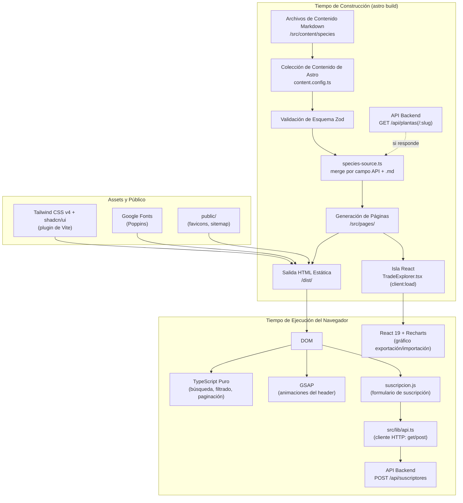
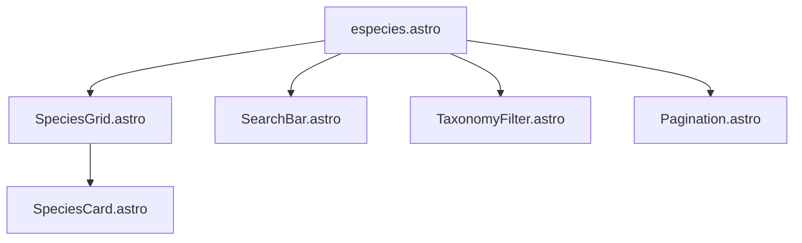
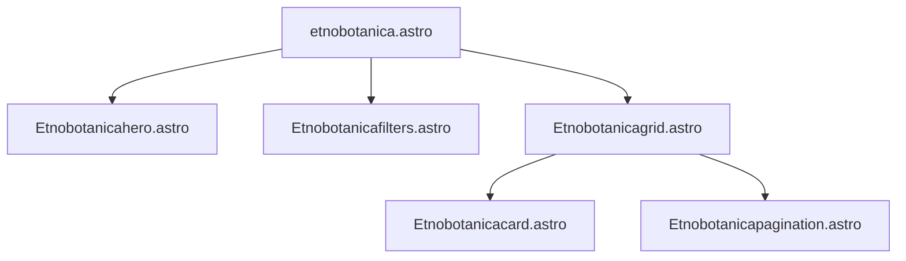
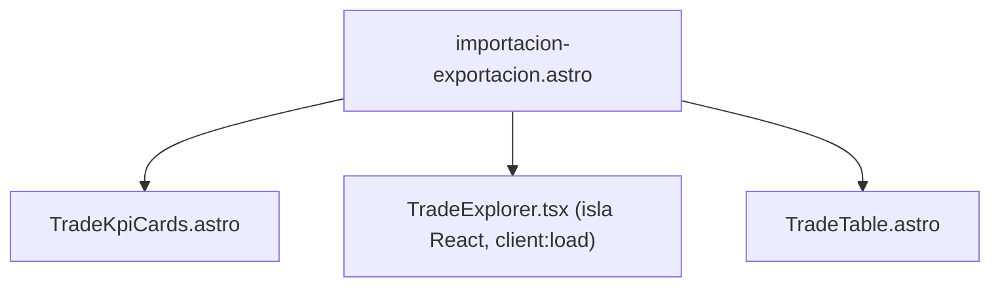
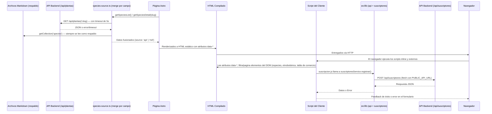

# Arquitectura — Ecotec Flora Médica

---

## Arquitectura de Alto Nivel

Ecotec Flora Médica es un **sitio Astro renderizado estáticamente en su mayoría** (SSG), con **islas de React** para las vistas de datos interactivas del panel de comercio internacional. La mayoría de la interactividad del lado del cliente (búsqueda, filtrado, paginación) sigue gestionándose con TypeScript puro inyectado en etiquetas `<script>` de Astro; React (vía `@astrojs/react`, `client:load`) se reserva para el explorador de comercio (`TradeExplorer.tsx`), que necesita estado local y un gráfico interactivo (Recharts).

Desde el `59d646b` (2026-08-01/02), el contenido de especies **ya no se lee directamente de las colecciones de Astro** en las páginas: pasa por una capa de datos (`src/lib/species-source.ts`) que intenta consumir el backend real (`GET /api/plantas`) y hace *merge por campo* con los archivos `.md` de respaldo. Esto significa que, en tiempo de build, cada página que necesita especies primero intenta la API y cae automáticamente al contenido Markdown si el backend no responde.



---

## Estructura de Carpetas

```
ecotec-flora-medica/
├── .astro/                     ← Generado automáticamente por Astro (no editar)
│   ├── collections/            ← Esquemas JSON generados para las colecciones de contenido
│   │   └── species.schema.json
│   ├── content.d.ts            ← Tipos TypeScript generados para las colecciones
│   ├── types.d.ts              ← Aumentaciones de tipos globales de Astro
│   └── settings.json           ← Configuración del IDE de Astro
├── .vscode/                    ← Configuración del editor
│   ├── extensions.json         ← Recomienda astro-build.astro-vscode
│   └── launch.json             ← Config de depuración para `astro dev`
├── components.json             ← Configuración de la CLI de shadcn/ui (estilo, alias, iconLibrary)
├── dist/                       ← Salida de la compilación (en .gitignore)
├── docs/                       ← Documentación del proyecto (esta carpeta)
├── mobile/                     ← App Android nativa (Kotlin + Jetpack Compose), proyecto Gradle independiente — ver mobile/README.md
├── node_modules/                ← Dependencias (en .gitignore)
├── public/                     ← Copiado tal cual a la raíz de dist/
│   ├── favicon.ico
│   ├── favicon-02.ico          ← Favicon activo (referenciado en BaseHead)
│   └── favicon.svg
├── src/
│   ├── assets/                 ← Procesados por el pipeline de imágenes de Astro
│   │   ├── blog-placeholder.jpg ← Imagen OG de respaldo (heredada del blog eliminado)
│   │   ├── logo-ecotec-2025-transparente.webp
│   │   ├── isotipo-samborondon.webp
│   │   ├── isotipo-guayaquil.webp
│   │   ├── isotipo-costa.webp
│   │   └── home_images/
│   │       └── home_image_grid_test.webp
│   ├── components/             ← Componentes Astro y React reutilizables
│   │   ├── BaseHead.astro
│   │   ├── Header.astro
│   │   ├── HeaderLink.astro
│   │   ├── Footer.astro
│   │   ├── ui/                 ← Componentes shadcn/ui (React, generados por su CLI)
│   │   │   ├── table.tsx
│   │   │   ├── badge.tsx
│   │   │   ├── select.tsx
│   │   │   ├── card.tsx
│   │   │   ├── tabs.tsx
│   │   │   ├── button.tsx
│   │   │   └── chart.tsx
│   │   ├── importexport/       ← Componentes del panel /importacion-exportacion
│   │   │   ├── TradeKpiCards.astro
│   │   │   ├── TradeTable.astro
│   │   │   └── TradeExplorer.tsx   ← Isla React (client:load): selector + gráfico Recharts
│   │   ├── species/            ← Componentes para la sección /especies
│   │   │   ├── SpeciesCard.astro
│   │   │   ├── SpeciesGrid.astro
│   │   │   ├── SearchBar.astro
│   │   │   ├── TaxonomyFilter.astro
│   │   │   └── Pagination.astro
│   │   └── etnobotanicacomp/   ← Componentes para la sección /etnobotanica
│   │       ├── Etnobotanicahero.astro
│   │       ├── Etnobotanicafilters.astro
│   │       ├── Etnobotanicagrid.astro
│   │       ├── Etnobotanicacard.astro
│   │       ├── Etnobotanicamodal.astro    ← Modal de detalle rápido sobre la tarjeta
│   │       └── Etnobotanicapagination.astro
│   ├── content/                ← Archivos de datos en Markdown
│   │   └── species/            ← Perfiles ricos de especies (contenido de respaldo del backend)
│   │       └── [slug].md
│   ├── data/                   ← Datasets estáticos consumidos en build time
│   │   ├── trade-data.json     ← Cifras de UN Comtrade pre-procesadas por especie
│   │   └── hs-code-map.mjs     ← Mapeo de especies a códigos arancelarios (HS)
│   ├── layouts/
│   │   └── Layout.astro        ← Envoltorio universal de página
│   ├── lib/                    ← Capa de datos e integración con la API del backend
│   │   ├── api.ts              ← Cliente HTTP genérico (PUBLIC_API_URL): get() con timeout + post()
│   │   ├── species-source.ts   ← Fuente única de especies: merge API (/api/plantas) + .md de respaldo
│   │   ├── suscriptores.ts     ← Servicio de suscriptores + SuscriptorDTO
│   │   ├── trade-data.ts       ← Cruce de trade-data.json con especies (para el panel de comercio)
│   │   └── utils.ts            ← Helper `cn()` (clsx + tailwind-merge) para componentes shadcn/ui
│   ├── pages/                  ← Enrutamiento basado en archivos
│   │   ├── index.astro         → /
│   │   ├── especies.astro      → /especies
│   │   ├── etnobotanica.astro  → /etnobotanica
│   │   ├── importacion-exportacion.astro → /importacion-exportacion
│   │   ├── sobre-nosotros.astro → /sobre-nosotros
│   │   ├── robots.txt.ts       → /robots.txt
│   │   └── especies/
│   │       └── [slug].astro    → /especies/[slug]
│   ├── scripts/                ← Scripts del lado del cliente (no inline)
│   │   └── suscripcion.js      ← Handler del formulario de suscripción
│   ├── styles/
│   │   └── global.css          ← Tailwind v4 + preset shadcn/ui + tokens @theme + estilos base
│   ├── consts.ts               ← Exportaciones de SITE_TITLE y SITE_DESCRIPTION
│   └── content.config.ts       ← Definición de la colección `species` y su esquema Zod
├── astro.config.mjs            ← Configuración de Astro
├── package.json
├── pnpm-lock.yaml
└── pnpm-workspace.yaml
```

---

## Enrutamiento

Astro usa **enrutamiento basado en archivos**. Cada archivo `.astro` o `.ts` en `src/pages/` se mapea directamente a una URL.

| Archivo | Ruta | Tipo |
|---|---|---|
| `src/pages/index.astro` | `/` | Estático |
| `src/pages/especies.astro` | `/especies` | Estático |
| `src/pages/etnobotanica.astro` | `/etnobotanica` | Estático |
| `src/pages/importacion-exportacion.astro` | `/importacion-exportacion` | Estático (con isla React) |
| `src/pages/sobre-nosotros.astro` | `/sobre-nosotros` | Estático |
| `src/pages/especies/[slug].astro` | `/especies/:slug` | Dinámico (SSG) |
| `src/pages/robots.txt.ts` | `/robots.txt` | Endpoint estático |
| *(generado por el plugin de sitemap)* | `/sitemap-index.xml` | Generado |

Las rutas dinámicas usan `getStaticPaths()` para enumerar todas las entradas en tiempo de construcción, produciendo un archivo HTML por especie.

> **Nota:** la sección de Blog (`/blog`, `/blog/[slug]`) fue **eliminada el 2026-08-02** (`a979739`) junto con la colección de contenido `blog` y el endpoint `rss.xml.js`, y reemplazada por la página institucional `/sobre-nosotros`. El enlace al feed RSS ya no se referencia en `BaseHead.astro`. **[inferido]** La dependencia `@astrojs/rss` sigue en `package.json` sin usarse en ningún archivo del proyecto — quedó huérfana de esa eliminación y sería candidata a retirarse.

---

## Arquitectura de Astro

### Modo de Salida Estática
El proyecto usa la salida **estática** predeterminada de Astro. Cada página se pre-renderiza a HTML. No hay ningún adaptador SSR configurado. Esto significa que la compilación produce un directorio `/dist` con HTML, CSS y JS puros que pueden ser servidos desde cualquier proveedor de alojamiento estático (Netlify, Vercel, S3, GitHub Pages, etc.).

### `astro.config.mjs`
```js
export default defineConfig({
  site: process.env.SITE_URL ?? 'http://localhost:4321',
  integrations: [sitemap(), react()],
  vite: {
    plugins: [tailwindcss()]
  }
});
```

Puntos clave:
- `site` es configurable mediante la variable de entorno `SITE_URL`, permitiendo diferentes destinos de despliegue sin cambios en el código.
- `@astrojs/sitemap` descubre automáticamente todas las rutas estáticas y genera `/sitemap-index.xml`.
- Tailwind se carga como plugin de Vite (no PostCSS), que es el enfoque recomendado para Tailwind v4.
- `@astrojs/react` (agregado en `3129b4b`) habilita islas de React dentro de páginas `.astro`. Solo se usa en `importacion-exportacion.astro`, que monta `<TradeExplorer client:load />`. El resto del sitio sigue siendo Astro puro sin hidratación de cliente vía framework.

### Transiciones de Vista
La API de Transiciones de Vista de Astro no está habilitada. El listener del evento `astro:page-load` en `Header.astro` y `especies.astro` sugiere que fue considerada (este evento se activa en la navegación de Transiciones de Vista), pero el componente `<ViewTransitions />` no se agrega a `Layout.astro`. **[inferido]** Probablemente sea una mejora futura.

---

## Layouts

### `src/layouts/Layout.astro`

El único layout universal utilizado por todas las páginas. Acepta tres props opcionales:

```typescript
interface Props {
  title?: string;        // por defecto SITE_TITLE
  description?: string;  // por defecto SITE_DESCRIPTION
  image?: ImageMetadata; // por defecto blog-placeholder.jpg para OG
}
```

Renderiza:
1. `<BaseHead>` — todos los metadatos
2. `<Header>` — navegación fija
3. `<main><slot /></main>` — contenido de la página inyectado aquí
4. `<Footer>` — barra de copyright

---

## Componentes

### Componentes Globales

#### `BaseHead.astro`
Gestiona todos los metadatos del `<head>`. Calcula la URL canónica y la URL de la imagen social relativa a `Astro.site`. Se importa solo en `Layout.astro`.

#### `Header.astro`
Navegación fija con:
- Logo como texto usando la clase `logo-font` (Poppins 600, 1.5rem).
- Cuatro elementos `<HeaderLink>`: Especies, Etnobotánica, Comercio (`/importacion-exportacion`) y Sobre nosotros (`/sobre-nosotros`) — el enlace de Blog fue retirado el 2026-08-02 junto con la sección.
- Botón CTA "SUSCRIBIRME" — actualmente comentado/oculto en el markup (no se renderiza).
- Animación de subrayado GSAP inicializada en una etiqueta `<script>`, reinicializada en `astro:page-load`.

#### `HeaderLink.astro`
Envuelve etiquetas `<a>` con:
- Detección del estado activo comparando `href` con `Astro.url.pathname`.
- `aria-current="page"` en el enlace activo.
- Clases CSS para el elemento de subrayado animado `.js-header-link-underline`.

#### `Footer.astro`
Footer completo de múltiples columnas alineado con el sitio de vinculación de ECOTEC. Estructura:

- **Columna izquierda:** logo principal de ECOTEC (`logo-ecotec-2025-transparente.webp`), tagline "Explora · Lidera · Transforma" y sección de admisiones con enlace directo a WhatsApp (`wa.me/593989880999`).
- **Columna central:** tres isotipos de campus (`isotipo-samborondon.webp`, `isotipo-guayaquil.webp`, `isotipo-costa.webp`) con sus nombres.
- **Columna derecha:** links institucionales (Sitio web, Vinculación, Contacto) y copyright.

Los cuatro assets de imagen son importados y procesados por el pipeline de Astro desde `src/assets/`.

### Componentes de Especies (`src/components/species/`)

Estos cinco componentes trabajan juntos para renderizar el catálogo `/especies`:



| Componente | Atributos de Datos | Propósito |
|---|---|---|
| `SpeciesGrid` | `data-species-root` | Envoltorio; contiene todas las tarjetas; muestra el estado vacío |
| `SpeciesCard` | `data-species-card`, `data-family`, `data-search-text` | Tarjeta individual; atributos de datos usados por el filtro JS |
| `SearchBar` | `data-species-search` | Campo de texto para búsqueda libre |
| `TaxonomyFilter` | `data-species-family` | Menú desplegable de selección para filtro de familia |
| `Pagination` | `data-species-pagination`, `data-species-page-*` | Paginación anterior/siguiente/numerada |

El JavaScript de filtrado vive en `especies.astro` como bloque `<script>`. Consulta todos los atributos `data-*` y conecta listeners de eventos `input`/`change`/`click`. Este patrón mantiene los componentes de Astro como generadores de HTML puro sin sobrecarga de framework.

### Componentes de Etnobotánica (`src/components/etnobotanicacomp/`)

Estructura espejo a los componentes de especies, para la página `/etnobotanica`:



`Etnobotanicagrid.astro` realiza una **unión derivada desde la fuente única de especies** (`getSpeciesList()`, ver [`src/lib/species-source.ts`](#srclibts--capa-de-datos-e-integración-con-el-backend)): a partir del 2026-07-15 se eliminó la colección independiente `etnobotanica` y sus 43 archivos `.md` en `src/content/etnobotanicacont/`. El componente:

1. Obtiene todas las especies activas vía `getSpeciesList()` (API + `.md`, ya fusionadas).
2. Infiere la categoría etnobotánica (MEDICINAL, ALIMENTICIA, ESTIMULANTE, AROMÁTICA, RITUAL, AGROECOLÓGICA) parseando el campo `etnobotanica.clasificacion` de cada especie.
3. Construye los datos de la tarjeta (badge, ícono, parte usada, uso tradicional, compuestos químicos) a partir de los mismos campos ricos del esquema de especie.

Esto elimina la duplicación de datos y garantiza que el atlas de etnobotánica esté siempre sincronizado con el catálogo de especies. Cada tarjeta (`Etnobotanicacard.astro`) abre `Etnobotanicamodal.astro` con el detalle rápido de la ficha sin abandonar la página del atlas.

### Componentes del Panel de Comercio (`src/components/importexport/`)

Añadidos en `d0a387e` (sección) y ampliados en `07782b6` (paginación) para la página `/importacion-exportacion`:



| Componente | Tipo | Propósito |
|---|---|---|
| `TradeKpiCards.astro` | Astro | Tarjetas resumen: total de especies, con datos Comtrade, solo narrativa, principal destino/origen |
| `TradeExplorer.tsx` | React (`client:load`) | Selector de especie (`ui/select.tsx`) + gráfico de barras de exportación/importación (Recharts vía `ui/chart.tsx`) + paneles narrativos de países |
| `TradeTable.astro` | Astro | Tabla (`ui/table.tsx`) con todas las especies, fuente de datos (Comtrade vs. narrativa) y resumen; incluye paginación del lado del cliente (10 filas por página) implementada con un bloque `<script>` propio, siguiendo el mismo patrón `data-*` que `Pagination.astro` |

Los datos provienen de `src/lib/trade-data.ts`, que cruza `src/data/trade-data.json` (cifras de UN Comtrade pre-procesadas, generadas fuera del build) con la lista de especies de `species-source.ts` por `slug`. Una especie sin código HS conocido o sin cifras de Comtrade se muestra igual, marcada como "cualitativo", usando el relato de `comercio.exportacion`/`comercio.importacion` de su ficha.

### Página Institucional (`src/pages/sobre-nosotros.astro`)

Reemplazó a la sección de Blog el 2026-08-02 (`a979739`). Es una página estática de una sola pieza (sin subcomponentes propios) con: hero, declaración de misión, banda de departamentos que colaboraron (Base de datos, Desarrollo, Diseño, Infraestructura, Documentación), grid de tarjetas "flip" del equipo (nombre/rol al frente, LinkedIn/correo al girar en hover) y grid de valores institucionales. Los datos del equipo y valores están hardcodeados como arrays en el frontmatter del propio archivo, no en una colección de contenido.

---

## Colecciones de Contenido

Definida en `src/content.config.ts` usando `defineCollection` de Astro + validación Zod.

| Colección | Directorio | Patrón de Carga | Complejidad del Esquema |
|---|---|---|---|
| `species` | `src/content/species/` | `**/*.md` | Rico (9 campos de nivel superior, objetos anidados, arrays) |

> **Historial:** la colección `etnobotanica` (43 archivos en `src/content/etnobotanicacont/`) fue **eliminada el 2026-07-15**; el atlas de etnobotánica deriva sus datos de `species` desde entonces. La colección `blog` (con su única entrada `primer-post.md`) fue **eliminada el 2026-08-02** junto con las páginas `/blog` y el endpoint `rss.xml.js`. El array `collections` exportado por `content.config.ts` quedó reducido a `{ species }`.

La colección usa el cargador `glob` de Astro, que escanea el directorio objetivo en tiempo de construcción y valida cada archivo contra el esquema, fallando la compilación ante cualquier violación del esquema. Como se documenta en [Flujo de Datos](#flujo-de-datos), esta colección ya no se consume directamente desde las páginas: sirve como contenido de respaldo (`fallback`) que `species-source.ts` fusiona con la respuesta de la API del backend.

---

## Assets

### `src/assets/`
Contiene archivos procesados por el pipeline de imágenes integrado de Astro (Vite + `@astrojs/image`). Actualmente:
- `blog-placeholder.jpg` — imagen OG de respaldo para páginas sin imagen explícita
- `home_images/home_image_grid_test.webp` — imagen de cuadrícula provisional usada en el hero del inicio
- `logo-ecotec-2025-transparente.webp` — logo principal de la Universidad ECOTEC (footer)
- `isotipo-samborondon.webp` — isotipo del campus Samborondón (footer)
- `isotipo-guayaquil.webp` — isotipo del campus Guayaquil (footer)
- `isotipo-costa.webp` — isotipo del campus Costa (footer)

### `public/`
Archivos copiados literalmente a la raíz de `dist/` sin procesamiento:
- `favicon.ico` — favicon ICO heredado
- `favicon-02.ico` — favicon activo referenciado en `BaseHead.astro`
- `favicon.svg` — favicon vectorial (presente pero no referenciado; **[inferido]** conservado para uso futuro)

---

## Estilos

### `src/styles/global.css`

La hoja de estilos única, importada tanto en `Layout.astro` como en `Header.astro`. Usa la directiva `@import "tailwindcss"` de Tailwind v4, el preset `shadcn/tailwind.css` (agregado en `3129b4b`) y un bloque `@theme` para definir tokens de diseño personalizados en escalas de 10 pasos.

**El 2026-08-01 (`07782b6`) el sistema de diseño se renovó por completo**, migrando de la paleta azul institucional plana (`#0049A4`) y las fuentes EB Garamond/Hanken Grotesk a escalas completas `primary`/`secondary`/`neutral` y tipografía unificada en Poppins:

```css
@theme {
    /* Escalas de 10 pasos (50–900) para primary (#0A5CA5), secondary (#2BBAE2) y neutral (#1A2843) */
    --color-primary: var(--color-primary-500);           /* #0A5CA5 */
    --color-secondary: var(--color-secondary-500);        /* #2BBAE2 */
    --color-tertiary: var(--color-neutral-500);           /* #1A2843 */
    --color-surface: var(--color-white-snow);             /* #FCFCFC */
    --color-surface-muted: var(--color-white-mist);       /* #EEF2F7 */
    --color-text: var(--color-neutral-500);
    --color-text-muted: var(--color-neutral-400);
    --radius-card: 1.5rem;
    --shadow-card: 0 20px 60px -24px rgba(10, 92, 165, 0.24);
    --font-display: 'Poppins', sans-serif;
    --font-body: 'Poppins', sans-serif;
}
```

Ver [`docs/DESIGN_SYSTEM.md`](./DESIGN_SYSTEM.md) para la tabla completa de las escalas de color, la configuración de shadcn/ui y los patrones de componentes. El `body` sigue aplicando gradientes radiales y un gradiente lineal fijo (ahora en tonos azul/teal) que dan profundidad al fondo sin imágenes. Estos tokens están disponibles como utilidades de Tailwind: `text-primary`, `bg-secondary`, `font-display`, etc. Además, `global.css` define el set estándar de variables `oklch()` de shadcn/ui (`--background`, `--card`, `--chart-1`…`--chart-5`, `--sidebar-*`, con variantes `.dark` sin uso activo), que alimentan exclusivamente a los componentes `src/components/ui/*.tsx`.

---

## Scripts y Utilidades

### Directorio `scripts/`
No existe como carpeta de automatización a nivel de repositorio (el directorio raíz `scripts/` mencionado en versiones previas de esta documentación nunca llegó a poblarse). Los scripts del lado del cliente viven en `src/scripts/` (ver más abajo); no hay scripts de build/migración de datos fuera de `package.json`.

### `src/lib/` — Capa de datos e integración con el backend

Iniciada el 2026-07-11 por Luis Eraso con la integración de suscriptores; ampliada sustancialmente el 2026-08-01/02 (`59d646b`, `d0a387e`) para la integración de especies y el panel de comercio. Contiene los módulos TypeScript que abstraen la comunicación con la API del backend y el acceso a datos.

#### `src/lib/api.ts`
Cliente HTTP genérico. Lee la URL base desde la variable de entorno `PUBLIC_API_URL` y expone dos métodos:
- **`api.get(endpoint, { timeoutMs = 5000 })`** — agregado en `59d646b`. Hace `fetch` con un `AbortController` que cancela la petición pasado el timeout (5s por defecto); lanza `Error` si `response.ok` es falso. Usado por `species-source.ts` para consultar `/api/plantas` y `/api/plantas/:slug` sin bloquear el build si el backend está caído o lento.
- **`api.post(endpoint, body)`** — sin cambios respecto a la versión original: `fetch` con `Content-Type: application/json`, deserializa JSON y lanza `Error` con el mensaje del servidor si la respuesta no es `ok`.

#### `src/lib/species-source.ts`
**Fuente única de datos de especies** — agregada en `59d646b` (2026-08-01/02). Toda página o componente que necesita especies debe leer de aquí en lugar de llamar a `getCollection('species')` directamente:
1. Intenta `GET /api/plantas` (listado) o `GET /api/plantas/:slug` (detalle) contra el backend.
2. Hace un **merge por campo** sobre el contenido `.md` correspondiente: usa el valor de la API salvo que venga vacío/ausente (`isBlank()`), en cuyo caso conserva el valor del `.md`. Los arrays de objetos (`comercio.exportacion/importacion`, `compuestosQuimicos`) se combinan por índice con `mergeItemArray()`, para no perder detalle que solo existe en el `.md` (p. ej. si la API trae `detalle` vacío en un compuesto).
3. Ante cualquier error de red, timeout o respuesta inválida, cae automáticamente al contenido `.md` (`source: 'md'` en el valor de retorno de `getSpeciesList()`).
4. Expone `getSpeciesList()` (lista para catálogo/home/atlas/comercio, slugs = unión API ∪ md) y `getSpeciesDetail(slug, mdData)` (ficha completa, incluye el campo opcional `analisisAcademico` que solo puede llegar desde la API).

Los archivos `.md` de `src/content/species` **siguen siendo el respaldo** y no se modifican por este proceso; la forma de datos que entrega esta capa es idéntica al frontmatter, así que los componentes de UI no necesitaron cambios al introducirla.

#### `src/lib/trade-data.ts`
Agregado en `d0a387e` para el panel `/importacion-exportacion`. `loadTradeDataset()` obtiene la lista de especies vía `getSpeciesList()` y la cruza por `slug` con `src/data/trade-data.json` (cifras de UN Comtrade pre-procesadas fuera del build). `computeKpis()` calcula los totales mostrados en `TradeKpiCards.astro` (especies con datos Comtrade, solo narrativa, principal destino de exportación/origen de importación).

#### `src/lib/suscriptores.ts`
Servicio específico para el recurso de suscriptores. Exporta:
- **`SuscriptorDTO`** — interfaz con `nombre?: string` y `correo: string`.
- **`suscriptoresService.registrar(datos)`** — llama a `POST /api/suscriptores` mediante `api.post`.

#### `src/lib/utils.ts`
Agregado con la integración de shadcn/ui (`3129b4b`). Exporta el helper `cn(...inputs)` (combinación de `clsx` + `tailwind-merge`), usado por todos los componentes de `src/components/ui/*.tsx` para componer clases condicionales sin colisiones de Tailwind.

### `src/scripts/` — Scripts del lado del cliente

#### `src/scripts/suscripcion.js`
Handler del formulario de suscripción. Se ejecuta en el navegador al cargar la página (`DOMContentLoaded`). Flujo:
1. Captura los valores de `#full-name` y `#email`.
2. Valida que ambos campos tengan valor.
3. Llama a `suscriptoresService.registrar()`.
4. Muestra feedback al usuario (éxito o error).

> **Nota arquitectónica:** Este script importa `suscriptoresService` en tiempo de ejecución del navegador, lo que requiere que `PUBLIC_API_URL` esté disponible como variable de entorno pública en tiempo de compilación (prefijo `PUBLIC_` de Astro/Vite).

### `src/consts.ts`
Un módulo TypeScript simple que exporta dos constantes de cadena:
- `SITE_TITLE = 'Ecotec Flora Médica'`
- `SITE_DESCRIPTION` — la descripción completa del sitio usada en las metaetiquetas y encabezados de página

---

## Flujo de Datos



Dos puntos clave:
1. **La consulta a la API de especies ocurre en tiempo de construcción, no en el navegador.** `species-source.ts` corre dentro del frontmatter de las páginas Astro (`getSpeciesList()`/`getSpeciesDetail()`), así que el resultado ya fusionado (API + `.md`) se incrusta en el HTML como atributos `data-*`, igual que antes de la integración. El JavaScript del lado del cliente sigue sin hacer peticiones de red para contenido de especies — solo lee y alterna elementos del DOM — por lo que el catálogo, el atlas y la tabla de comercio siguen cargando instantáneamente y funcionando offline una vez servido el HTML.
2. Las únicas peticiones de red en **tiempo de ejecución del navegador** son el formulario de suscripción (`POST /api/suscriptores`) y las llamadas internas de Recharts/React dentro de la isla `TradeExplorer.tsx` (que operan sobre los `rows` ya recibidos como props, sin red adicional).
