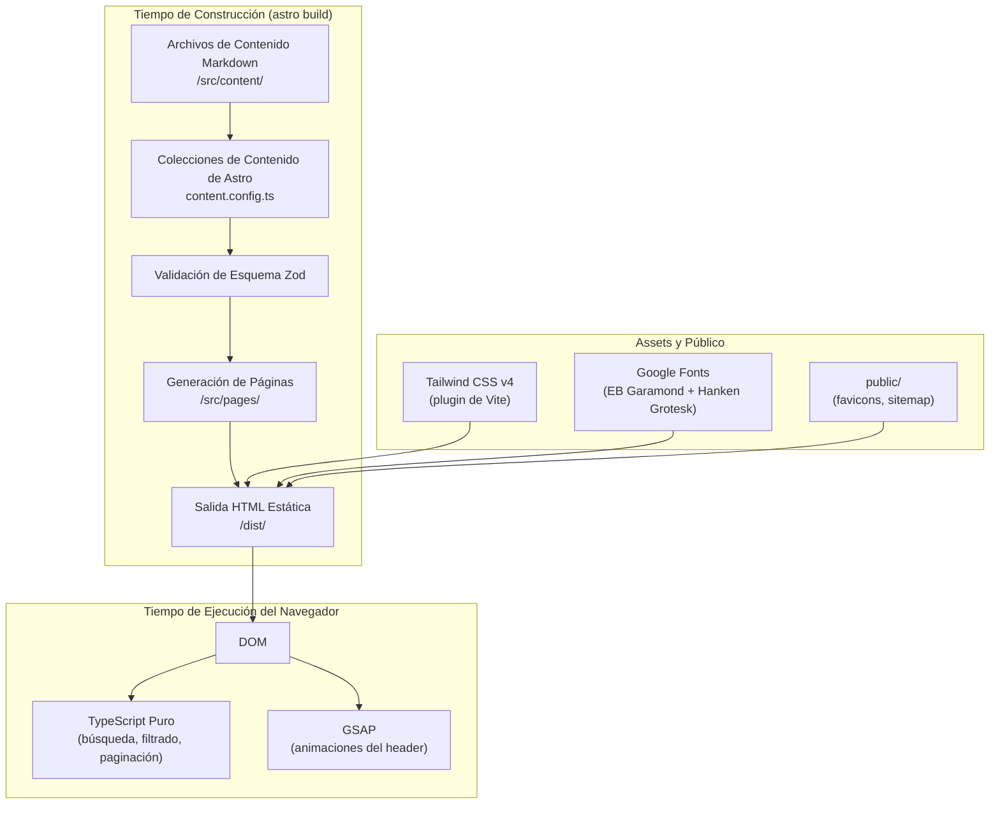
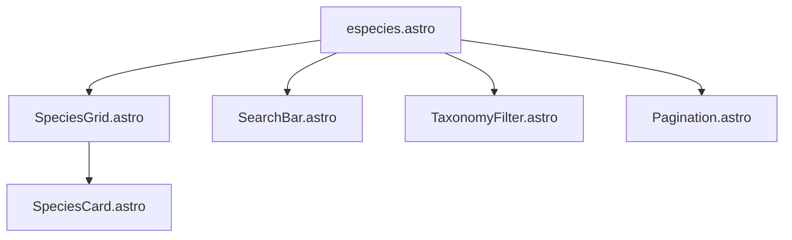
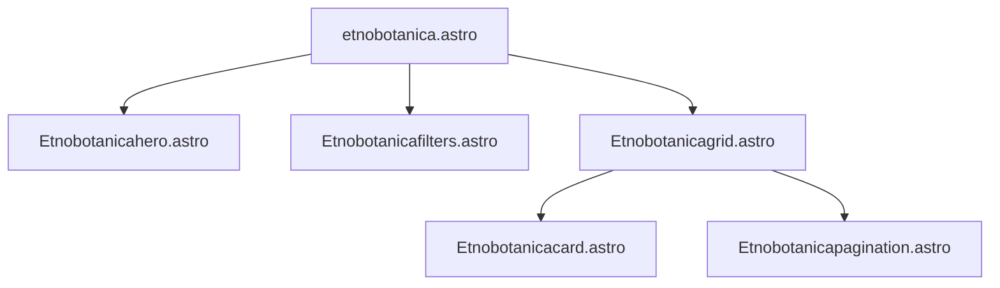
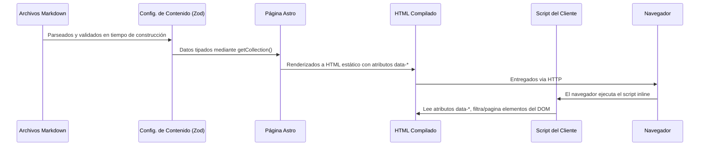

# Arquitectura — Ecotec Flora Médica

---

## Arquitectura de Alto Nivel

Ecotec Flora Médica es un **sitio Astro completamente estático** sin tiempo de ejecución del lado del servidor. Todas las páginas se renderizan a HTML en tiempo de construcción. La interactividad del lado del cliente (búsqueda, filtrado, paginación) se gestiona mediante TypeScript puro inyectado a través de etiquetas `<script>` de Astro — no se utiliza ningún framework de frontend.



---

## Estructura de Carpetas

```
ecotec-flora-medica/
├── .astro/                     ← Generado automáticamente por Astro (no editar)
│   ├── collections/            ← Esquemas JSON generados para las colecciones de contenido
│   │   ├── blog.schema.json
│   │   ├── etnobotanica.schema.json
│   │   └── species.schema.json
│   ├── content.d.ts            ← Tipos TypeScript generados para las colecciones
│   ├── types.d.ts              ← Aumentaciones de tipos globales de Astro
│   └── settings.json           ← Configuración del IDE de Astro
├── .vscode/                    ← Configuración del editor
│   ├── extensions.json         ← Recomienda astro-build.astro-vscode
│   └── launch.json             ← Config de depuración para `astro dev`
├── dist/                       ← Salida de la compilación (en .gitignore)
├── docs/                       ← Documentación del proyecto (esta carpeta)
├── node_modules/               ← Dependencias (en .gitignore)
├── public/                     ← Copiado tal cual a la raíz de dist/
│   ├── favicon.ico
│   ├── favicon-02.ico          ← Favicon activo (referenciado en BaseHead)
│   └── favicon.svg
├── scripts/                    ← Vacío; reservado para scripts de datos/build
├── src/
│   ├── assets/                 ← Procesados por el pipeline de imágenes de Astro
│   │   ├── blog-placeholder.jpg
│   │   └── home_images/
│   │       └── home_image_grid_test.webp
│   ├── components/             ← Componentes Astro reutilizables
│   │   ├── BaseHead.astro
│   │   ├── Header.astro
│   │   ├── HeaderLink.astro
│   │   ├── Footer.astro
│   │   ├── species/            ← Componentes para la sección /especies
│   │   │   ├── SpeciesCard.astro
│   │   │   ├── SpeciesGrid.astro
│   │   │   ├── SearchBar.astro
│   │   │   ├── TaxonomyFilter.astro
│   │   │   └── Pagination.astro
│   │   └── etnobotanicacomp/   ← Componentes para la sección /etnobotanica
│   │       ├── Etnobotanicahero.astro
│   │       ├── Etnobotanicafilters.astro
│   │       ├── Etnobotanicagrid.astro
│   │       ├── Etnobotanicacard.astro
│   │       └── Etnobotanicapagination.astro
│   ├── content/                ← Archivos de datos en Markdown
│   │   ├── blog/               ← Entradas de posts del blog
│   │   │   └── primer-post.md
│   │   ├── species/            ← Perfiles ricos de especies (39 entradas)
│   │   │   └── [slug].md
│   │   └── etnobotanicacont/   ← Tarjetas de etnobotánica simplificadas (43 entradas)
│   │       └── [slug].md
│   ├── layouts/
│   │   └── Layout.astro        ← Envoltorio universal de página
│   ├── pages/                  ← Enrutamiento basado en archivos
│   │   ├── index.astro         → /
│   │   ├── especies.astro      → /especies
│   │   ├── etnobotanica.astro  → /etnobotanica
│   │   ├── robots.txt.ts       → /robots.txt
│   │   ├── blog/
│   │   │   ├── index.astro     → /blog
│   │   │   └── [slug].astro    → /blog/[id]
│   │   └── especies/
│   │       └── [slug].astro    → /especies/[slug]
│   ├── styles/
│   │   └── global.css          ← Importaciones de Tailwind + tokens @theme + estilos base
│   ├── consts.ts               ← Exportaciones de SITE_TITLE y SITE_DESCRIPTION
│   └── content.config.ts       ← Definiciones de colecciones y esquemas Zod
├── astro.config.mjs            ← Configuración de Astro
├── package.json
├── pnpm-lock.yaml
└── pnpm-workspace.yaml
```

---

## Enrutamiento

Astro usa **enrutamiento basado en archivos**. Cada archivo `.astro` o `.ts` en `src/pages/` se mapea directamente a una URL.

| Archivo | Ruta | Tipo |
|---|---|---|
| `src/pages/index.astro` | `/` | Estático |
| `src/pages/especies.astro` | `/especies` | Estático |
| `src/pages/etnobotanica.astro` | `/etnobotanica` | Estático |
| `src/pages/blog/index.astro` | `/blog` | Estático |
| `src/pages/blog/[slug].astro` | `/blog/:id` | Dinámico (SSG) |
| `src/pages/especies/[slug].astro` | `/especies/:slug` | Dinámico (SSG) |
| `src/pages/robots.txt.ts` | `/robots.txt` | Endpoint estático |
| *(generado por el plugin de sitemap)* | `/sitemap-index.xml` | Generado |

Las rutas dinámicas usan `getStaticPaths()` para enumerar todas las entradas en tiempo de construcción, produciendo un archivo HTML por especie y por post de blog.

---

## Arquitectura de Astro

### Modo de Salida Estática
El proyecto usa la salida **estática** predeterminada de Astro. Cada página se pre-renderiza a HTML. No hay ningún adaptador SSR configurado. Esto significa que la compilación produce un directorio `/dist` con HTML, CSS y JS puros que pueden ser servidos desde cualquier proveedor de alojamiento estático (Netlify, Vercel, S3, GitHub Pages, etc.).

### `astro.config.mjs`
```js
export default defineConfig({
  site: process.env.SITE_URL ?? 'http://localhost:4321',
  integrations: [sitemap()],
  vite: {
    plugins: [tailwindcss()]
  }
});
```

Puntos clave:
- `site` es configurable mediante la variable de entorno `SITE_URL`, permitiendo diferentes destinos de despliegue sin cambios en el código.
- `@astrojs/sitemap` descubre automáticamente todas las rutas estáticas y genera `/sitemap-index.xml`.
- Tailwind se carga como plugin de Vite (no PostCSS), que es el enfoque recomendado para Tailwind v4.

### Transiciones de Vista
La API de Transiciones de Vista de Astro no está habilitada. El listener del evento `astro:page-load` en `Header.astro` y `especies.astro` sugiere que fue considerada (este evento se activa en la navegación de Transiciones de Vista), pero el componente `<ViewTransitions />` no se agrega a `Layout.astro`. **[inferido]** Probablemente sea una mejora futura.

---

## Layouts

### `src/layouts/Layout.astro`

El único layout universal utilizado por todas las páginas. Acepta tres props opcionales:

```typescript
interface Props {
  title?: string;        // por defecto SITE_TITLE
  description?: string;  // por defecto SITE_DESCRIPTION
  image?: ImageMetadata; // por defecto blog-placeholder.jpg para OG
}
```

Renderiza:
1. `<BaseHead>` — todos los metadatos
2. `<Header>` — navegación fija
3. `<main><slot /></main>` — contenido de la página inyectado aquí
4. `<Footer>` — barra de copyright

---

## Componentes

### Componentes Globales

#### `BaseHead.astro`
Gestiona todos los metadatos del `<head>`. Calcula la URL canónica y la URL de la imagen social relativa a `Astro.site`. Se importa solo en `Layout.astro`.

#### `Header.astro`
Navegación fija con:
- Logo como texto usando la clase `logo-font` (EB Garamond 500 1.5rem).
- Tres elementos `<HeaderLink>` (Especies, Etnobotánica, Blog).
- Botón CTA "SUSCRIBIRME" (actualmente solo UI).
- Animación de subrayado GSAP inicializada en una etiqueta `<script>`, reinicializada en `astro:page-load`.

#### `HeaderLink.astro`
Envuelve etiquetas `<a>` con:
- Detección del estado activo comparando `href` con `Astro.url.pathname`.
- `aria-current="page"` en el enlace activo.
- Clases CSS para el elemento de subrayado animado `.js-header-link-underline`.

#### `Footer.astro`
Pie de página mínimo: una línea de texto de copyright con el año actual calculado en tiempo de construcción.

### Componentes de Especies (`src/components/species/`)

Estos cinco componentes trabajan juntos para renderizar el catálogo `/especies`:



| Componente | Atributos de Datos | Propósito |
|---|---|---|
| `SpeciesGrid` | `data-species-root` | Envoltorio; contiene todas las tarjetas; muestra el estado vacío |
| `SpeciesCard` | `data-species-card`, `data-family`, `data-search-text` | Tarjeta individual; atributos de datos usados por el filtro JS |
| `SearchBar` | `data-species-search` | Campo de texto para búsqueda libre |
| `TaxonomyFilter` | `data-species-family` | Menú desplegable de selección para filtro de familia |
| `Pagination` | `data-species-pagination`, `data-species-page-*` | Paginación anterior/siguiente/numerada |

El JavaScript de filtrado vive en `especies.astro` como bloque `<script>`. Consulta todos los atributos `data-*` y conecta listeners de eventos `input`/`change`/`click`. Este patrón mantiene los componentes de Astro como generadores de HTML puro sin sobrecarga de framework.

### Componentes de Etnobotánica (`src/components/etnobotanicacomp/`)

Estructura espejo a los componentes de especies, para la página `/etnobotanica`:



`Etnobotanicagrid.astro` realiza una unión entre colecciones: obtiene tanto la colección `species` como `etnobotanica`, usa la colección de especies para establecer el orden y la presencia (filtrando entradas de etnobotánica sin especie coincidente) y renderiza las tarjetas en el orden de las especies.

---

## Colecciones de Contenido

Definidas en `src/content.config.ts` usando `defineCollection` de Astro + validación Zod.

| Colección | Directorio | Patrón de Carga | Complejidad del Esquema |
|---|---|---|---|
| `blog` | `src/content/blog/` | `**/*.md` | Simple (title, description, pubDate, tags) |
| `species` | `src/content/species/` | `**/*.md` | Rico (9 campos de nivel superior, objetos anidados, arrays) |
| `etnobotanica` | `src/content/etnobotanicacont/` | `**/*.md` | Moderado (7 campos planos) |

Todas las colecciones usan el cargador `glob` de Astro, que escanea el directorio objetivo en tiempo de construcción y valida cada archivo contra el esquema, fallando la compilación ante cualquier violación del esquema.

---

## Assets

### `src/assets/`
Contiene archivos procesados por el pipeline de imágenes integrado de Astro (Vite + `@astrojs/image`). Actualmente:
- `blog-placeholder.jpg` — imagen OG de respaldo para páginas sin imagen explícita
- `home_images/home_image_grid_test.webp` — imagen de cuadrícula provisional usada en el hero del inicio (la misma imagen repetida en las 5 celdas; **[inferido]** en espera de fotografías reales)

### `public/`
Archivos copiados literalmente a la raíz de `dist/` sin procesamiento:
- `favicon.ico` — favicon ICO heredado
- `favicon-02.ico` — favicon activo referenciado en `BaseHead.astro`
- `favicon.svg` — favicon vectorial (presente pero no referenciado; **[inferido]** conservado para uso futuro)

---

## Estilos

### `src/styles/global.css`

La hoja de estilos única, importada tanto en `Layout.astro` como en `Header.astro`. Usa la directiva `@import "tailwindcss"` de Tailwind v4 y un bloque `@theme` para definir tokens de diseño personalizados:

```css
@theme {
    --color-primary: #1B6D24;
    --color-primary-fixed-dim: #2E7D3C;
    --color-secondary: #A86B3D;
    --color-secondary-fixed-dim: #C58A55;
    --color-tertiary: #6A7D45;
    --color-tertiary-fixed-dim: #869A5E;
    --color-surface: #FAFCFA;
    --color-surface-muted: #F3F4EF;
    --color-text: #1F2A22;
    --color-text-muted: #5F675F;
    --radius-card: 1.5rem;
    --shadow-card: 0 20px 60px -24px rgba(27, 109, 36, 0.2);
    --font-display: 'EB Garamond', serif;
    --font-body: 'Hanken Grotesk', sans-serif;
}
```

Estos tokens están disponibles como utilidades de Tailwind: `text-primary`, `bg-secondary`, `font-display`, etc.

---

## Scripts y Utilidades

### Directorio `scripts/`
Actualmente vacío. **[inferido]** Este directorio probablemente fue creado con la intención de alojar scripts de migración de datos, scripts de generación de contenido o helpers de despliegue. Aún no existe ningún script.

### `src/consts.ts`
Un módulo TypeScript simple que exporta dos constantes de cadena:
- `SITE_TITLE = 'Ecotec Flora Médica'`
- `SITE_DESCRIPTION` — la descripción completa del sitio usada en las metaetiquetas y encabezados de página

---

## Flujo de Datos



El punto clave es que **todos los datos se incrustan en el HTML como atributos de datos en tiempo de construcción**. El JavaScript del lado del cliente nunca realiza peticiones de red — simplemente lee y alterna elementos del DOM, lo que hace que las funcionalidades interactivas funcionen sin conexión y carguen instantáneamente.
