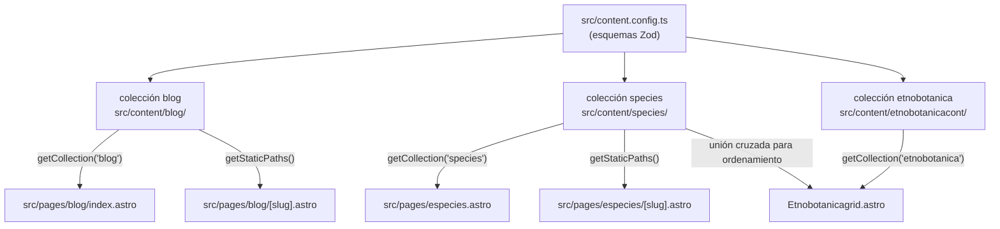
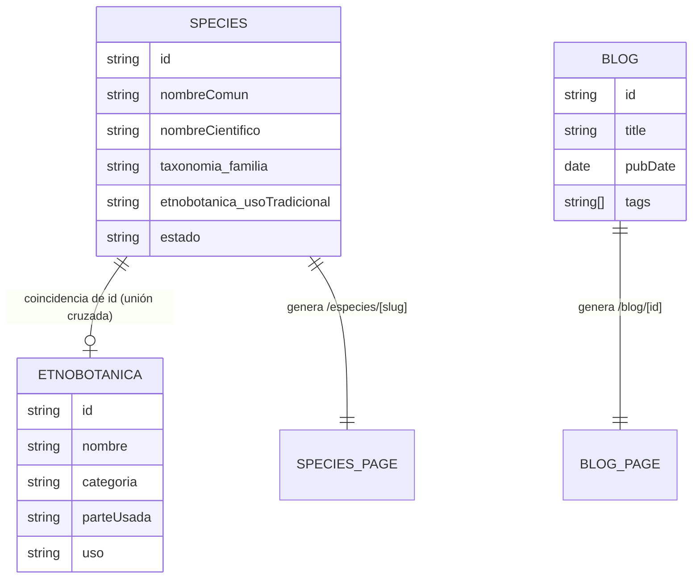

# Estructura de Contenido — Ecotec Flora Médica

---

## Descripción General

El sitio usa el sistema de **Colecciones de Contenido** de Astro para gestionar tres fuentes de datos independientes basadas en Markdown. Todas las colecciones están definidas en `src/content.config.ts` y se validan en tiempo de construcción usando esquemas Zod.



---

## Colección 1: `blog`

**Directorio:** `src/content/blog/`
**Cargador:** `glob({ pattern: '**/*.md' })`

### Esquema del Frontmatter

```typescript
z.object({
  title: z.string(),
  description: z.string(),
  pubDate: z.date(),
  updatedDate: z.date().optional(),
  tags: z.array(z.string()).default([]),
})
```

| Campo | Tipo | Requerido | Descripción |
|---|---|---|---|
| `title` | string | Sí | Título del artículo, usado en `<title>` de página y encabezado del listado |
| `description` | string | Sí | Texto de resumen, usado en meta descripción y extracto del listado |
| `pubDate` | date | Sí | Fecha de publicación; los posts se ordenan de forma descendente por este campo |
| `updatedDate` | date | No | Fecha de última actualización; se renderiza si está presente |
| `tags` | string[] | No (predeterminado: []) | Etiquetas de tema renderizadas como insignias de pastilla en las páginas de listado y detalle |

### Enrutamiento
El blog usa `entry.id` (el nombre de archivo sin extensión) como slug de URL. Por ejemplo, `primer-post.md` → `/blog/primer-post`.

### Entradas Actuales

| ID | Título | Fecha | Etiquetas |
|---|---|---|---|
| `primer-post` | *(post de ejemplo)* | 2026-06-13 | flora, etnobotánica, divulgación |

La infraestructura del blog es completamente funcional con solo un post de ejemplo. El esquema y las plantillas están listos para cualquier número de artículos.

---

## Colección 2: `species`

**Directorio:** `src/content/species/`
**Cargador:** `glob({ pattern: '**/*.md' })`

Esta es la colección de datos científicos principal. Cada archivo representa una especie medicinal con un perfil rico y estructurado.

### Esquema del Frontmatter

```typescript
z.object({
  slug: z.string().optional(),
  nombreComun: z.string(),
  nombreCientifico: z.string(),
  nombresAlternativos: z.array(z.string()).default([]),
  taxonomia: z.object({
    reino: z.string(),
    division: z.string(),
    clase: z.string(),
    familia: z.string(),
    genero: z.string(),
  }),
  etnobotanica: z.object({
    clasificacion: z.string(),
    parteUtilizada: z.string(),
    usoTradicional: z.string(),
  }),
  perfilEtnobotanico: z.string(),
  historiaEvolucion: z.object({
    origen: z.string(),
    dispersion: z.string(),
    evolucion: z.string(),
  }),
  comercio: z.object({
    exportacion: z.array(z.object({ pais: z.string(), detalle: z.string() })),
    importacion: z.array(z.object({ pais: z.string(), detalle: z.string() })),
  }),
  compuestosQuimicos: z.array(z.object({
    nombre: z.string(),
    detalle: z.string(),
  })),
  multimediaPrincipal: z.object({
    imagenUrl: z.string(),
    imagenPublicId: z.string().optional(),
    videoUrl: z.string().optional(),
    videoPublicId: z.string().optional(),
    proveedor: z.string(),
  }),
  estado: z.enum(['ACTIVO', 'INACTIVO', 'BORRADOR']),
})
```

### Referencia de Campos

| Campo | Tipo | Requerido | Descripción |
|---|---|---|---|
| `slug` | string | No | URL personalizada; por defecto usa `entry.id` (nombre de archivo) |
| `nombreComun` | string | Sí | Nombre común en español (p. ej., "Achiote") |
| `nombreCientifico` | string | Sí | Nombre latín binomial (p. ej., "Bixa orellana") |
| `nombresAlternativos` | string[] | No | Otros nombres comunes regionales |
| `taxonomia.reino` | string | Sí | Reino taxonómico (siempre "Plantae") |
| `taxonomia.division` | string | Sí | División (p. ej., "Magnoliophyta") |
| `taxonomia.clase` | string | Sí | Clase (p. ej., "Magnoliopsida") |
| `taxonomia.familia` | string | Sí | Familia — campo clave para filtrado (p. ej., "Asteraceae") |
| `taxonomia.genero` | string | Sí | Género (p. ej., "Matricaria") |
| `etnobotanica.clasificacion` | string | Sí | Etiqueta corta de clasificación (p. ej., "Medicinal aromática") |
| `etnobotanica.parteUtilizada` | string | Sí | Parte de la planta usada (p. ej., "Flores", "Bulbo", "Semillas") |
| `etnobotanica.usoTradicional` | string | Sí | Uso tradicional — también usado como descripción de tarjeta |
| `perfilEtnobotanico` | string | Sí | Perfil etnobotánico de 1–3 párrafos |
| `historiaEvolucion.origen` | string | Sí | Origen geográfico y uso precolonial |
| `historiaEvolucion.dispersion` | string | Sí | Cómo se dispersó la planta globalmente |
| `historiaEvolucion.evolucion` | string | Sí | Clasificación botánica y notas de adaptación |
| `comercio.exportacion` | array | Sí | Principales países exportadores con detalles |
| `comercio.importacion` | array | Sí | Principales países importadores con detalles |
| `compuestosQuimicos` | array | Sí | Compuestos químicos activos con nombres y descripciones |
| `multimediaPrincipal.imagenUrl` | string | Sí | URL de la imagen principal |
| `multimediaPrincipal.imagenPublicId` | string | No | ID de activo CMS/CDN (Cloudinary) |
| `multimediaPrincipal.videoUrl` | string | No | URL de video opcional |
| `multimediaPrincipal.videoPublicId` | string | No | ID de video CMS/CDN |
| `multimediaPrincipal.proveedor` | string | Sí | Proveedor de la imagen (p. ej., "PICSUM", "CLOUDINARY") |
| `estado` | enum | Sí | Estado de publicación: `ACTIVO`, `INACTIVO` o `BORRADOR` |

### Cuerpo en Markdown
Cada archivo de especie tiene un cuerpo en Markdown que se renderiza en la sección "Análisis académico / Introducción y Contexto" de la página de detalle. Es una introducción en prosa a la especie.

### Enrutamiento
`getStaticPaths()` mapea cada entrada a `/especies/[slug]`, usando `entry.data.slug ?? entry.id` como parámetro de URL.

### Número de Entradas del Catálogo

Actualmente hay 39 especies catalogadas:

| Slug | Nombre Común | Nombre Científico | Familia |
|---|---|---|---|
| achiote | Achiote | *Bixa orellana* | Bixaceae |
| aji | Ají | *Capsicum annuum* | Solanaceae |
| ajo | Ajo | *Allium sativum* | Amaryllidaceae |
| aloe-vera | Aloe Vera | *Aloe barbadensis* | Asphodelaceae |
| apio | Apio | *Apium graveolens* | Apiaceae |
| babaco | Babaco | *Vasconcellea × heilbornii* | Caricaceae |
| cebolla | Cebolla | *Allium cepa* | Amaryllidaceae |
| cedron | Cedrón | *Aloysia citrodora* | Verbenaceae |
| cola-de-caballo | Cola de Caballo | *Equisetum arvense* | Equisetaceae |
| culantro | Culantro | *Coriandrum sativum* | Apiaceae |
| dulcamara | Dulcamara | *Solanum dulcamara* | Solanaceae |
| eucalipto | Eucalipto | *Eucalyptus globulus* | Myrtaceae |
| guanabana | Guanábana | *Annona muricata* | Annonaceae |
| guayaba | Guayaba | *Psidium guajava* | Myrtaceae |
| hierba-luisa | Hierba Luisa | *Cymbopogon citratus* | Poaceae |
| jengibre | Jengibre | *Zingiber officinale* | Zingiberaceae |
| limon | Limón | *Citrus limon* | Rutaceae |
| llanten | Llantén | *Plantago major* | Plantaginaceae |
| mandarina | Mandarina | *Citrus reticulata* | Rutaceae |
| manzanilla | Manzanilla | *Matricaria chamomilla* | Asteraceae |
| matico | Matico | *Piper aduncum* | Piperaceae |
| menta-piperita | Menta Piperita | *Mentha × piperita* | Lamiaceae |
| naranja-dulce | Naranja Dulce | *Citrus sinensis* | Rutaceae |
| naranjo-amargo | Naranjo Amargo | *Citrus aurantium* | Rutaceae |
| neem | Neem | *Azadirachta indica* | Meliaceae |
| ortiga | Ortiga | *Urtica dioica* | Urticaceae |
| papaya | Papaya | *Carica papaya* | Caricaceae |
| pepino | Pepino | *Solanum muricatum* | Solanaceae |
| perejil | Perejil | *Petroselinum crispum* | Apiaceae |
| pimiento | Pimiento | *Capsicum annuum* | Solanaceae |
| romero | Romero | *Salvia rosmarinus* | Lamiaceae |
| ruda | Ruda | *Ruta graveolens* | Rutaceae |
| tomate-de-arbol | Tomate de Árbol | *Solanum betaceum* | Solanaceae |
| tomate | Tomate | *Solanum lycopersicum* | Solanaceae |
| tomillo | Tomillo | *Thymus vulgaris* | Lamiaceae |
| una-de-gato | Uña de Gato | *Uncaria tomentosa* | Rubiaceae |
| uvilla | Uvilla | *Physalis peruviana* | Solanaceae |
| valeriana | Valeriana | *Valeriana officinalis* | Caprifoliaceae |
| zapallo | Zapallo | *Cucurbita maxima* | Cucurbitaceae |

### Familias Botánicas Representadas

| Familia | Nº de Especies | Ejemplo |
|---|---|---|
| Solanaceae | 6 | Tomate, Ají, Dulcamara |
| Rutaceae | 4 | Limón, Mandarina, Ruda |
| Amaryllidaceae | 2 | Ajo, Cebolla |
| Lamiaceae | 3 | Romero, Tomillo, Menta |
| Apiaceae | 3 | Apio, Culantro, Perejil |
| Asteraceae | 1 | Manzanilla |
| Myrtaceae | 2 | Eucalipto, Guayaba |
| Caricaceae | 2 | Papaya, Babaco |
| Otras | 16 | Varias |

---

## Colección 3: `etnobotanica`

**Directorio:** `src/content/etnobotanicacont/`
**Cargador:** `glob({ pattern: '**/*.md' })`

Esta es una colección simplificada enfocada en las tarjetas etnobotánicas para la página del Atlas Etnobotánico. Contiene menos detalle que la colección `species` y probablemente fue diseñada para ser consumida por una vista diferente.

### Esquema del Frontmatter

```typescript
z.object({
  nombre: z.string(),
  cientifico: z.string(),
  categoria: z.string(),
  parteUsada: z.string(),
  uso: z.string(),
  compuestos: z.string(),
  img: z.string().url(),
})
```

| Campo | Tipo | Requerido | Descripción |
|---|---|---|---|
| `nombre` | string | Sí | Nombre común |
| `cientifico` | string | Sí | Nombre científico |
| `categoria` | string | Sí | Categoría para filtrado (MEDICINAL, ALIMENTICIA, etc.) |
| `parteUsada` | string | Sí | Parte de la planta (cadena única, no estructurada) |
| `uso` | string | Sí | Descripción del uso principal |
| `compuestos` | string | Sí | Compuestos químicos como una única cadena formateada |
| `img` | string (URL) | Sí | URL de la imagen (debe ser una URL válida) |

### Categorías

| Categoría | Color de Insignia | Ícono |
|---|---|---|
| MEDICINAL | `text-emerald-800 bg-emerald-50` | `ti-heart-plus` |
| RITUAL | `text-purple-700 bg-purple-50` | `ti-sparkles` |
| ALIMENTICIA | `text-amber-700 bg-amber-50` | `ti-tools-kitchen-2` |
| ESTIMULANTE | `text-blue-700 bg-blue-50` | `ti-bolt` |
| AROMÁTICA | `text-emerald-700 bg-emerald-50` | `ti-flower` |
| AGROECOLÓGICA | `text-green-700 bg-green-50` | `ti-seeding` |

### Número de Entradas

43 entradas — 4 más que la colección `species`. Especies con entradas de etnobotánica pero sin página de detalle de especie: amaranto, guayusa, higuerilla, salvia.

---

## Relación Entre Colecciones

Las colecciones `etnobotanica` y `species` están **vinculadas por ID de archivo compartido (slug)**. El componente `Etnobotanicagrid.astro` implementa esta relación:

```javascript
// 1. Obtener colección de especies para establecer el orden
const species = await getCollection('species');
const speciesOrder = new Map(species.map((entry, index) => [entry.id, index]));

// 2. Filtrar y ordenar entradas de etnobotanica según el orden de especies
const plantas = (await getCollection('etnobotanica'))
  .filter((planta) => speciesOrder.has(planta.id))  // solo mostrar si existe la especie
  .sort((a, b) => (speciesOrder.get(a.id) ?? 0) - (speciesOrder.get(b.id) ?? 0));
```

Esto significa que:
- Una entrada de `etnobotanica` sin una entrada `species` coincidente **no aparecerá** en la página de etnobotánica.
- El orden de visualización sigue el orden de la colección `species` (alfabético por `nombreComun`).
- Ambas tarjetas enlazan a `/especies/[slug]` para el detalle completo.



---

## Imágenes

### Proveedores de Imágenes

| Proveedor | Patrón | Usado En |
|---|---|---|
| picsum.photos | `https://picsum.photos/seed/[nombre]/1200/800` | La mayoría de las especies (39 entradas) |
| Unsplash | `https://images.unsplash.com/...` | Algunas especies (manzanilla, menta-piperita, romero, naranjo-amargo) |
| Cloudinary | Campo `imagenPublicId` poblado | Proveedor futuro planificado |

**[inferido]** Picsum.photos es un CDN de marcador de posición. El campo `proveedor` en `multimediaPrincipal` y la presencia de los campos `imagenPublicId`/`videoPublicId` sugieren que el equipo planea migrar a Cloudinary para la gestión de medios una vez que se disponga de fotografías reales.

### Dimensiones de Imágenes

Las imágenes de especies se solicitan a `1200×800px` desde picsum.photos. Se renderizan en:
- Relación de aspecto `aspect-[4/3]` en tarjetas de especies
- Altura completa `h-[520px]` en el hero del detalle de especie
- Altura fija `h-48` en tarjetas de etnobotánica

---

## Taxonomías y Clasificación

### Jerarquía Taxonómica

Cada entrada de especie sigue la clasificación linneana estándar hasta el nivel de género:

```
Reino (Kingdom)   → siempre Plantae
  División (Division)
    Clase (Class)
      Familia (Family)      ← clave para filtrado
        Género (Genus)
          [Especie inferida de nombreCientifico]
```

El campo `familia` es el único rango taxonómico usado para filtrado en la UI. La jerarquía completa se muestra en las migas de pan taxonómicas de la página de detalle.

### Clasificación Etnobotánica

Independiente de la taxonomía, cada especie lleva una clasificación etnobotánica:

```
clasificacion  → etiqueta de clasificación legible por humanos
parteUtilizada → órgano vegetal usado terapéuticamente
usoTradicional → aplicación tradicional principal
```

La colección `etnobotanica` usa un sistema categórico más granular (MEDICINAL, ALIMENTICIA, ESTIMULANTE, AROMÁTICA, RITUAL, AGROECOLÓGICA) que se mapea a los botones de filtro en la página del atlas.

---

## Ejemplo de Entrada de Contenido

A continuación se muestra una entrada de especie representativa (`src/content/species/achiote.md`) con la estructura de datos completa:

```yaml
---
nombreComun: "Achiote"
nombreCientifico: "Bixa orellana"
nombresAlternativos: []
taxonomia:
  reino: "Plantae"
  division: "Magnoliophyta"
  clase: "Magnoliopsida"
  familia: "Bixaceae"
  genero: "Bixa"
etnobotanica:
  clasificacion: "Medicinal y tintórea"
  parteUtilizada: "Semillas"
  usoTradicional: "Antioxidante"
perfilEtnobotanico: |
    Uso medicinal y tintóreo. Las semillas ...
historiaEvolucion:
  origen: |
      Nativo de América Tropical ...
  dispersion: |
      Los europeos lo llevaron a Asia ...
  evolucion: |
      Pertenece a la familia Bixaceae ...
comercio:
  exportacion:
    - pais: "Perú, Brasil, Kenia y Costa de Marfil"
      detalle: "Principales exportadores ..."
  importacion:
    - pais: "Unión Europea, Estados Unidos y Japón"
      detalle: "Importan el colorante ..."
compuestosQuimicos:
  - nombre: "Bixina y Norbixina"
    detalle: "Carotenoides responsables ..."
  - nombre: "Tocotrienoles (Vitamina E)"
    detalle: "Potentes antioxidantes ..."
  - nombre: "Flavonoides"
    detalle: "Presentes en las hojas ..."
multimediaPrincipal:
  imagenUrl: "https://picsum.photos/seed/achiote/1200/800"
  imagenPublicId: ""
  videoUrl: ""
  videoPublicId: ""
  proveedor: "PICSUM"
estado: "ACTIVO"
---

El achiote (Bixa orellana) es un arbusto originario ...
```
