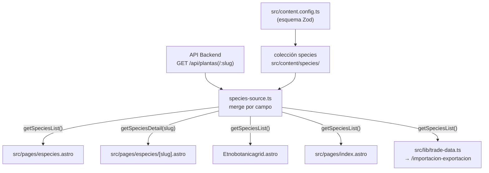

# Estructura de Contenido — Ecotec Flora Médica

---

## Descripción General

El sitio usa el sistema de **Colecciones de Contenido** de Astro para gestionar los datos de especies en Markdown, pero **ya no es la única fuente de datos**: desde el `59d646b` (2026-08-01/02), toda página o componente lee especies a través de `src/lib/species-source.ts`, que primero intenta el backend real (`GET /api/plantas`) y usa la colección `species` como respaldo cuando la API no responde. La colección se define en `src/content.config.ts` y se valida en tiempo de construcción usando un esquema Zod.

Históricamente el proyecto tuvo tres colecciones (`blog`, `species`, `etnobotanica`); las otras dos fueron eliminadas:
- **`etnobotanica`** (43 archivos en `src/content/etnobotanicacont/`) — eliminada el 2026-07-15. El atlas de etnobotánica deriva sus datos de `species` desde entonces.
- **`blog`** (1 archivo, `primer-post.md`) — eliminada el 2026-08-02 junto con las páginas `/blog`, `/blog/[slug]` y el endpoint `rss.xml.js`, reemplazada por la página institucional `/sobre-nosotros`.



---

## Colección: `species`

**Directorio:** `src/content/species/`
**Cargador:** `glob({ pattern: '**/*.md', base: './src/content/species' })`

Esta es la única colección de contenido del proyecto y la fuente de respaldo de datos científicos. Cada archivo representa una especie medicinal con un perfil rico y estructurado. El esquema no ha cambiado desde su definición original (`c41a8ec`, julio 2026).

### Esquema del Frontmatter

```typescript
z.object({
  slug: z.string().optional(),
  nombreComun: z.string(),
  nombreCientifico: z.string(),
  nombresAlternativos: z.array(z.string()).default([]),
  taxonomia: z.object({
    reino: z.string(),
    division: z.string(),
    clase: z.string(),
    familia: z.string(),
    genero: z.string(),
  }),
  etnobotanica: z.object({
    clasificacion: z.string(),
    parteUtilizada: z.string(),
    usoTradicional: z.string(),
  }),
  perfilEtnobotanico: z.string(),
  historiaEvolucion: z.object({
    origen: z.string(),
    dispersion: z.string(),
    evolucion: z.string(),
  }),
  comercio: z.object({
    exportacion: z.array(z.object({ pais: z.string(), detalle: z.string() })),
    importacion: z.array(z.object({ pais: z.string(), detalle: z.string() })),
  }),
  compuestosQuimicos: z.array(z.object({
    nombre: z.string(),
    detalle: z.string(),
  })),
  multimediaPrincipal: z.object({
    imagenUrl: z.string().url(),
    imagenPublicId: z.string().optional(),
    videoUrl: z.string().optional(),
    videoPublicId: z.string().optional(),
    proveedor: z.string(),
  }),
  estado: z.enum(['ACTIVO', 'INACTIVO', 'BORRADOR']),
})
```

### Referencia de Campos

| Campo | Tipo | Requerido | Descripción |
|---|---|---|---|
| `slug` | string | No | URL personalizada; por defecto usa `entry.id` (nombre de archivo) |
| `nombreComun` | string | Sí | Nombre común en español (p. ej., "Achiote") |
| `nombreCientifico` | string | Sí | Nombre latín binomial (p. ej., "Bixa orellana") |
| `nombresAlternativos` | string[] | No | Otros nombres comunes regionales |
| `taxonomia.reino` | string | Sí | Reino taxonómico (siempre "Plantae") |
| `taxonomia.division` | string | Sí | División (p. ej., "Magnoliophyta") |
| `taxonomia.clase` | string | Sí | Clase (p. ej., "Magnoliopsida") |
| `taxonomia.familia` | string | Sí | Familia — campo clave para filtrado (p. ej., "Asteraceae") |
| `taxonomia.genero` | string | Sí | Género (p. ej., "Matricaria") |
| `etnobotanica.clasificacion` | string | Sí | Etiqueta corta de clasificación (p. ej., "Medicinal aromática") — también usada por `Etnobotanicagrid.astro` para inferir la categoría del atlas |
| `etnobotanica.parteUtilizada` | string | Sí | Parte de la planta usada (p. ej., "Flores", "Bulbo", "Semillas") |
| `etnobotanica.usoTradicional` | string | Sí | Uso tradicional — también usado como descripción de tarjeta |
| `perfilEtnobotanico` | string | Sí | Perfil etnobotánico de 1–3 párrafos |
| `historiaEvolucion.origen` | string | Sí | Origen geográfico y uso precolonial |
| `historiaEvolucion.dispersion` | string | Sí | Cómo se dispersó la planta globalmente |
| `historiaEvolucion.evolucion` | string | Sí | Clasificación botánica y notas de adaptación |
| `comercio.exportacion` | array | Sí | Principales países exportadores con detalles — también alimenta el relato "cualitativo" del panel de comercio cuando no hay cifras de Comtrade |
| `comercio.importacion` | array | Sí | Principales países importadores con detalles — ídem |
| `compuestosQuimicos` | array | Sí | Compuestos químicos activos con nombres y descripciones |
| `multimediaPrincipal.imagenUrl` | string (URL) | Sí | URL de la imagen principal |
| `multimediaPrincipal.imagenPublicId` | string | No | ID de activo CMS/CDN (Cloudinary) |
| `multimediaPrincipal.videoUrl` | string | No | URL de video opcional |
| `multimediaPrincipal.videoPublicId` | string | No | ID de video CMS/CDN |
| `multimediaPrincipal.proveedor` | string | Sí | Proveedor de la imagen (p. ej., "PICSUM", "CLOUDINARY") |
| `estado` | enum | Sí | Estado de publicación: `ACTIVO`, `INACTIVO` o `BORRADOR` — solo entran a `getSpeciesList()` las que tengan `ACTIVO` |

### Cuerpo en Markdown
Cada archivo de especie tiene un cuerpo en Markdown que se renderiza en la sección "Análisis académico / Introducción y Contexto" de la página de detalle. Es una introducción en prosa a la especie.

### Enrutamiento
`getStaticPaths()` en `src/pages/especies/[slug].astro` mapea cada entrada a `/especies/[slug]`, usando `entry.data.slug ?? entry.id` como parámetro de URL. Los slugs enumerados son la **unión** de los que existen en la API y en el `.md` local (ver `species-source.ts`), no solo los archivos Markdown.

### Número de Entradas del Catálogo

Actualmente hay 41 especies en `src/content/species/`:

| Slug | Nombre Común | Nombre Científico | Familia |
|---|---|---|---|
| achiote | Achiote | *Bixa orellana* | Bixaceae |
| ajo | Ajo | *Allium sativum* | Amaryllidaceae |
| aloe-vera | Aloe vera | *Aloe vera* | Asphodelaceae |
| apio | Apio | *Apium graveolens* | Apiaceae |
| babaco | Babaco | *Vasconcellea × heilbornii* | Caricaceae |
| cebolla | Cebolla | *Allium cepa* | Amaryllidaceae |
| cedron | Cedrón | *Aloysia citrodora* | Verbenaceae |
| cola-de-caballo | Cola de Caballo | *Equisetum arvense* | Equisetaceae |
| culantro | Culantro / Cilantro | *Coriandrum sativum* | Apiaceae |
| dulcamara | Dulcamara | *Solanum dulcamara* | Solanaceae |
| eucalipto | Eucalipto | *Eucalyptus globulus* | Myrtaceae |
| guanabana | Guanábana / Graviola | *Annona muricata* | Annonaceae |
| guayaba | Guayaba / Guayabo | *Psidium guajava* | Myrtaceae |
| hierba-luisa | Hierba Luisa / Limonaria | *Cymbopogon citratus* | Poaceae |
| hortensia | Hortensia | *Hydrangea macrophylla* | Hydrangeaceae |
| jengibre | Jengibre | *Zingiber officinale* | Zingiberaceae |
| lazo-de-amor | Lazo de Amor | *Episcia cupreata* | Gesneriaceae |
| limon | Limón / Limonero | *Citrus limon* | Rutaceae |
| llanten | Llantén | *Plantago major* | Plantaginaceae |
| madre-de-miles | Madre de Miles | *Kalanchoe daigremontiana* | Crassulaceae |
| mandarina | Mandarina / Mandarino | *Citrus reticulata* | Rutaceae |
| manzanilla | Manzanilla | *Matricaria chamomilla* | Asteraceae |
| matico | Matico | *Piper aduncum* | Piperaceae |
| menta-piperita | Menta | *Mentha piperita* | Lamiaceae |
| naranja-dulce | Naranja Dulce / Naranjo | *Citrus sinensis* | Rutaceae |
| naranjo-amargo | Naranjo Amargo | *Citrus aurantium* | Rutaceae |
| neem | Neem / Nim | *Azadirachta indica* | Meliaceae |
| ortiga | Ortiga | *Urtica dioica* | Urticaceae |
| papaya | Papaya | *Carica papaya* | Caricaceae |
| pepino | Pepino | *Cucumis sativus* | Cucurbitaceae |
| perejil | Perejil | *Petroselinum crispum* | Apiaceae |
| pimiento | Pimiento | *Capsicum annuum var. grossum* | Solanaceae |
| romero | Romero | *Salvia rosmarinus* | Lamiaceae |
| ruda | Ruda | *Ruta graveolens* | Rutaceae |
| tomate-de-arbol | Tomate de Árbol | *Solanum betaceum* | Solanaceae |
| tomate | Tomate | *Solanum lycopersicum* | Solanaceae |
| tomillo | Tomillo | *Thymus vulgaris* | Lamiaceae |
| una-de-gato | Uña de Gato | *Uncaria tomentosa* | Rubiaceae |
| uvilla | Uvilla | *Physalis peruviana* | Solanaceae |
| valeriana | Valeriana | *Valeriana officinalis* | Caprifoliaceae |
| zapallo | Zapallo / Calabaza / Auyama | *Cucurbita maxima* | Cucurbitaceae |

> **Nota:** este conteo refleja solo los archivos `.md` locales. En producción, `getSpeciesList()` puede mostrar más o menos entradas según lo que exponga `GET /api/plantas` en cada momento (slugs = unión API ∪ `.md`).

### Familias Botánicas Representadas

| Familia | Nº de Especies | Ejemplo |
|---|---|---|
| Solanaceae | 5 | Tomate, Dulcamara, Pimiento |
| Rutaceae | 5 | Limón, Mandarina, Ruda |
| Lamiaceae | 3 | Romero, Tomillo, Menta |
| Apiaceae | 3 | Apio, Culantro, Perejil |
| Myrtaceae | 2 | Eucalipto, Guayaba |
| Cucurbitaceae | 2 | Pepino, Zapallo |
| Caricaceae | 2 | Papaya, Babaco |
| Amaryllidaceae | 2 | Ajo, Cebolla |
| Otras (16 familias) | 1 c/u | Bixaceae, Asteraceae, Verbenaceae, etc. |

---

## Datos Derivados: Atlas Etnobotánico

El atlas de `/etnobotanica` **no tiene datos propios** — `Etnobotanicagrid.astro` construye cada tarjeta a partir de la especie correspondiente:

```javascript
// src/components/etnobotanicacomp/Etnobotanicagrid.astro
const { rows: activeSpecies } = await getSpeciesList();

const plantas = activeSpecies.map((especie) => {
  const categorias = getCategories(
    especie.data.etnobotanica.clasificacion,
    especie.data.etnobotanica.usoTradicional,
  ); // parsea texto libre → MEDICINAL | ALIMENTICIA | ESTIMULANTE | AROMÁTICA | RITUAL | AGROECOLÓGICA
  // ...arma badge, ícono, compuestos, etc. desde el mismo esquema de species
});
```

### Categorías del Atlas

| Categoría | Ícono Tabler | Cómo se infiere |
|---|---|---|
| MEDICINAL | `ti-heart-plus` | `clasificacion`/`usoTradicional` contiene "medicinal" (también es el valor por defecto si no matchea ninguna) |
| ALIMENTICIA | `ti-tools-kitchen-2` | contiene "alimenticia" o "condimento" |
| ESTIMULANTE | `ti-bolt` | contiene "estimulante" |
| AROMÁTICA | `ti-flower` | contiene "aromática"/"aromatica" |
| RITUAL | `ti-sparkles` | contiene "ritual" |
| AGROECOLÓGICA | `ti-seeding` | contiene "agroecológica"/"agroecologica" |

Una especie puede matchear varias categorías (el filtro las considera todas); la primera categoría matcheada define el color/ícono principal de la tarjeta. Esto significa que:
- El atlas de etnobotánica siempre está sincronizado con el catálogo de especies — no puede haber una entrada huérfana en un lado y no en el otro.
- El campo `etnobotanica.clasificacion` de cada `.md` funciona, en la práctica, como un campo de texto libre parseado por palabras clave — vale la pena mantenerlo consistente (usar "medicinal", "alimenticia", etc. explícitamente) para que la categorización automática funcione como se espera.

---

## Datos Derivados: Panel de Comercio Internacional

`src/lib/trade-data.ts` cruza `getSpeciesList()` con `src/data/trade-data.json` (dataset de UN Comtrade pre-procesado fuera del ciclo de build normal, con año de generación y códigos HS por especie) usando el `slug` como llave:

```javascript
const trade = (tradeData.species as Record<string, any>)[slug];
if (!trade) return null; // especie sin fila en el dataset de Comtrade → no aparece en el panel
```

Para las especies que sí tienen fila, el `narrative` (relato cualitativo mostrado cuando no hay cifras numéricas, o como complemento) se toma directamente de `comercio.exportacion`/`comercio.importacion` de la ficha `.md`/API — es la misma información que ya se muestra en la página de detalle de la especie, reutilizada aquí sin duplicarla.

---

## Imágenes

### Proveedores de Imágenes

| Proveedor | Patrón | Usado En |
|---|---|---|
| picsum.photos | `https://picsum.photos/seed/[nombre]/1200/800` | La mayoría de las especies |
| Unsplash | `https://images.unsplash.com/...` | Algunas especies (manzanilla, menta-piperita, romero, naranjo-amargo) |
| Cloudinary | Campo `imagenPublicId` poblado | Proveedor futuro planificado |

**[inferido]** Picsum.photos es un CDN de marcador de posición. El campo `proveedor` en `multimediaPrincipal` y la presencia de los campos `imagenPublicId`/`videoPublicId` sugieren que el equipo planea migrar a Cloudinary para la gestión de medios una vez que se disponga de fotografías reales.

### Dimensiones de Imágenes

Las imágenes de especies se solicitan a `1200×800px` desde picsum.photos. Se renderizan en:
- Relación de aspecto `aspect-4/3` en tarjetas de especies
- Altura completa `h-130` (32.5rem ≈ 520px, migrado desde el valor arbitrario `h-[520px]` en `f1f756f`/`7e1d267`) en el hero del detalle de especie
- Altura fija `h-48` en tarjetas de etnobotánica

---

## Taxonomías y Clasificación

### Jerarquía Taxonómica

Cada entrada de especie sigue la clasificación linneana estándar hasta el nivel de género:

```
Reino (Kingdom)   → siempre Plantae
  División (Division)
    Clase (Class)
      Familia (Family)      ← clave para filtrado
        Género (Genus)
          [Especie inferida de nombreCientifico]
```

El campo `familia` es el único rango taxonómico usado para filtrado en la UI. La jerarquía completa se muestra en las migas de pan taxonómicas de la página de detalle.

### Clasificación Etnobotánica

Independiente de la taxonomía, cada especie lleva una clasificación etnobotánica:

```
clasificacion  → etiqueta de clasificación legible por humanos (y fuente de la categorización del atlas)
parteUtilizada → órgano vegetal usado terapéuticamente
usoTradicional → aplicación tradicional principal
```

El atlas de etnobotánica usa un sistema categórico más granular (MEDICINAL, ALIMENTICIA, ESTIMULANTE, AROMÁTICA, RITUAL, AGROECOLÓGICA) que se mapea a los botones de filtro en la página, inferido a partir de `clasificacion`/`usoTradicional` como se describe arriba.

---

## Ejemplo de Entrada de Contenido

A continuación se muestra una entrada de especie representativa (`src/content/species/achiote.md`) con la estructura de datos completa:

```yaml
---
nombreComun: "Achiote"
nombreCientifico: "Bixa orellana"
nombresAlternativos: []
taxonomia:
  reino: "Plantae"
  division: "Magnoliophyta"
  clase: "Magnoliopsida"
  familia: "Bixaceae"
  genero: "Bixa"
etnobotanica:
  clasificacion: "Medicinal y tintórea"
  parteUtilizada: "Semillas"
  usoTradicional: "Antioxidante"
perfilEtnobotanico: |
    Uso medicinal y tintóreo. Las semillas ...
historiaEvolucion:
  origen: |
      Nativo de América Tropical ...
  dispersion: |
      Los europeos lo llevaron a Asia ...
  evolucion: |
      Pertenece a la familia Bixaceae ...
comercio:
  exportacion:
    - pais: "Perú, Brasil, Kenia y Costa de Marfil"
      detalle: "Principales exportadores ..."
  importacion:
    - pais: "Unión Europea, Estados Unidos y Japón"
      detalle: "Importan el colorante ..."
compuestosQuimicos:
  - nombre: "Bixina y Norbixina"
    detalle: "Carotenoides responsables ..."
  - nombre: "Tocotrienoles (Vitamina E)"
    detalle: "Potentes antioxidantes ..."
  - nombre: "Flavonoides"
    detalle: "Presentes en las hojas ..."
multimediaPrincipal:
  imagenUrl: "https://picsum.photos/seed/achiote/1200/800"
  imagenPublicId: ""
  videoUrl: ""
  videoPublicId: ""
  proveedor: "PICSUM"
estado: "ACTIVO"
---

El achiote (Bixa orellana) es un arbusto originario ...
```
