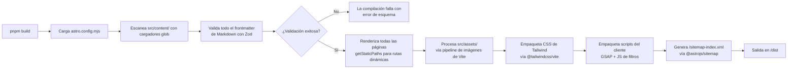

# Despliegue — Ecotec Flora Médica

---

## Descripción General

El proyecto es un **sitio Astro completamente estático** sin tiempo de ejecución del lado del servidor. La salida de la compilación es un directorio de archivos HTML, CSS y JS que puede desplegarse en cualquier proveedor de alojamiento estático sin configuración adicional.

---

## Proceso de Compilación

### Requisitos Previos

| Requisito | Versión |
|---|---|
| Node.js | `>=22.12.0` |
| pnpm | cualquier versión reciente |

### Scripts Disponibles

Definidos en `package.json`:

```json
{
  "scripts": {
    "dev": "astro dev",
    "build": "astro build",
    "preview": "astro preview",
    "astro": "astro"
  }
}
```

| Comando | Descripción |
|---|---|
| `pnpm dev` | Inicia el servidor de desarrollo local en `http://localhost:4321` con HMR |
| `pnpm build` | Compila el sitio en `/dist` |
| `pnpm preview` | Sirve la compilación de `/dist` localmente para pruebas previas al despliegue |
| `pnpm astro` | Acceso directo a la CLI de Astro |

### Pasos de Compilación (lo que hace `astro build`)



### Estructura de la Salida de Compilación

```
dist/
├── index.html                  ← Página de inicio
├── especies/
│   ├── index.html              ← Catálogo de especies
│   ├── achiote/
│   │   └── index.html         ← Página de detalle por especie
│   ├── ajo/
│   │   └── index.html
│   └── ... (39 páginas de especies)
├── etnobotanica/
│   └── index.html
├── blog/
│   ├── index.html
│   └── primer-post/
│       └── index.html
├── robots.txt
├── sitemap-index.xml
├── favicon-02.ico
├── favicon.ico
├── favicon.svg
└── _astro/
    ├── [hash].css              ← Bundle de CSS de Tailwind
    └── [hash].js               ← Bundle de scripts del cliente
```

---

## Variables de Entorno

| Variable | Valor Predeterminado | Descripción |
|---|---|---|
| `SITE_URL` | `http://localhost:4321` | Usada por Astro como URL base `site` para URLs canónicas, etiquetas OG, sitemap y robots.txt |

**Establece esta variable en tu entorno de alojamiento** para que coincida con tu dominio de producción. Por ejemplo:
```
SITE_URL=https://flora.ecotec.edu.ec
```

Esta variable fluye hacia:
- `<link>` canónico en el head de cada página
- Meta tag `og:url` de Open Graph
- Meta tag `twitter:url` de Twitter
- URLs del sitemap
- Referencia del sitemap en `robots.txt`

---

## Alojamiento

**[inferido]** No hay ningún proveedor de alojamiento configurado en el repositorio (no se encontraron archivos `netlify.toml`, `vercel.json`, `.github/workflows/` ni similares). El proyecto puede desplegarse en cualquier host estático.

### Opciones de Alojamiento Recomendadas

| Proveedor | Esfuerzo | Notas |
|---|---|---|
| **Vercel** | Sin configuración | Detecta Astro automáticamente; establece la variable de entorno `SITE_URL` |
| **Netlify** | Sin configuración | Detecta Astro; admite arrastrar y soltar o integración con Git |
| **GitHub Pages** | Bajo | Requiere la ruta `base` en `astro.config.mjs` si no está en la raíz |
| **AWS S3 + CloudFront** | Medio | CDN completo; establece `SITE_URL` al dominio de CloudFront |
| **Cualquier servidor Apache/Nginx** | Bajo | Copia el contenido de `dist/` a la raíz web |

### Comandos de Despliegue

```bash
# Instalar dependencias
pnpm install

# Compilar
SITE_URL=https://tu-dominio.com pnpm build

# Desplegar: copiar dist/ a tu host
```

---

## CI/CD

**No hay ningún pipeline de CI/CD en el repositorio.** El directorio `scripts/` está vacío y no hay flujos de trabajo de GitHub Actions, GitLab CI ni similares.

**[inferido]** El despliegue es actualmente manual. Dado el equipo (proyecto universitario con una rama `dev` que recibe ramas de funcionalidades fusionadas), el flujo de trabajo esperado es:

1. El desarrollador hace push a su rama de funcionalidad.
2. El desarrollador líder revisa y fusiona en `dev`.
3. Cuando está listo, `dev` se fusiona en `main`.
4. Alguien ejecuta manualmente `pnpm build` y despliega.

### Configuración de CI/CD Sugerida (GitHub Actions)

Un flujo de trabajo mínimo para despliegue automático a cualquier host estático:

```yaml
# .github/workflows/deploy.yml
name: Despliegue

on:
  push:
    branches: [main]

jobs:
  build-and-deploy:
    runs-on: ubuntu-latest
    steps:
      - uses: actions/checkout@v4
      - uses: pnpm/action-setup@v4
      - uses: actions/setup-node@v4
        with:
          node-version: 22
          cache: pnpm

      - run: pnpm install --frozen-lockfile
      - run: pnpm build
        env:
          SITE_URL: ${{ secrets.SITE_URL }}

      # Luego agrega el paso de despliegue de tu proveedor de alojamiento
      # p. ej., para Netlify: netlify-labs/netlify-actions
      # p. ej., para Vercel: amondnet/vercel-action
```

---

## Optimización

### Lo que Astro Hace Automáticamente

| Optimización | Detalle |
|---|---|
| HTML estático | Todas las páginas se pre-renderizan — costo cero de renderizado del lado del servidor |
| Hashing de assets | Los archivos CSS y JS en `_astro/` tienen hashes de contenido para caché de larga duración |
| Empaquetado de CSS | Tailwind solo emite las clases utilitarias usadas (sin CSS muerto) |
| Optimización de imágenes | El pipeline de Vite de Astro optimiza las imágenes en `src/assets/` |
| División de código | El JS de cada página es mínimo; los scripts de GSAP y filtros solo se empaquetan cuando son necesarios |
| Sitemap | Generado automáticamente en tiempo de compilación |

### Carga de Imágenes Externas

Actualmente, todas las imágenes de especies se cargan desde CDN externos (picsum.photos, Unsplash). Esto significa que:
- Las imágenes **no** son procesadas por el pipeline de imágenes de Astro.
- No se genera carga diferida (lazy-loading) ni `srcset` para las imágenes de especies.
- Existe una dependencia de la disponibilidad de servicios externos.

**[inferido]** La migración a Cloudinary (sugerida por los campos `imagenPublicId` y `proveedor` en el esquema de especies) permitiría:
- Transformaciones de imágenes responsive.
- Eliminación de la dependencia de picsum.photos.
- Gestión coherente de medios.

### Consideraciones de Rendimiento

- GSAP se carga como dependencia JS del lado del cliente en cada página (animación del encabezado). Con ~70KB minimizado+comprimido, este es el payload de JavaScript más grande.
- La fuente de íconos Tabler (usada en la sección de etnobotánica) se carga desde un CDN. **[inferido]** Esta fuente probablemente se referencia en `Etnobotanicafilters.astro` mediante una etiqueta `<link>` — no se importa como paquete — lo que significa que no está empaquetada.
- Las Google Fonts (`EB Garamond`, `Hanken Grotesk`) se cargan en tiempo de ejecución desde `fonts.googleapis.com`. Para producción, se deberían considerar sugerencias de preconexión y subconjuntos de fuentes.
