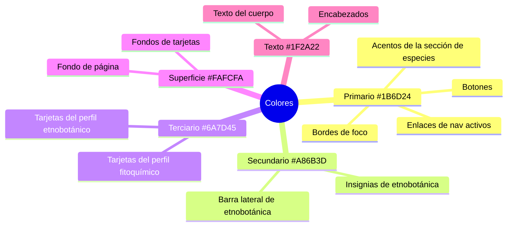

# Sistema de Diseño — Ecotec Flora Médica

Todos los tokens están definidos en `src/styles/global.css` usando el bloque `@theme` de Tailwind v4, lo que los hace disponibles como clases utilitarias de Tailwind y propiedades CSS nativas en todo el proyecto.

---

## Paleta de Colores

### Colores de Marca (Tokens de Tema Personalizados)

| Token | Variable CSS | Hex | Uso |
|---|---|---|---|
| `primary` | `--color-primary` | `#1B6D24` | Verde bosque principal — botones, enlaces, acentos, bordes |
| `primary-fixed-dim` | `--color-primary-fixed-dim` | `#2E7D3C` | Primario más oscuro para estados hover |
| `secondary` | `--color-secondary` | `#A86B3D` | Ámbar/terracota cálido — acentos de etnobotánica |
| `secondary-fixed-dim` | `--color-secondary-fixed-dim` | `#C58A55` | Secundario más claro para hover |
| `tertiary` | `--color-tertiary` | `#6A7D45` | Verde salvia/oliva — acentos de fitoquímica |
| `tertiary-fixed-dim` | `--color-tertiary-fixed-dim` | `#869A5E` | Terciario más claro |
| `surface` | `--color-surface` | `#FAFCFA` | Fondo de página — blanco cálido muy claro |
| `surface-muted` | `--color-surface-muted` | `#F3F4EF` | Superficies atenuadas, tarjetas secundarias |
| `text` | `--color-text` | `#1F2A22` | Texto principal — casi negro con subtono verde |
| `text-muted` | `--color-text-muted` | `#5F675F` | Texto secundario, leyendas |

### Paleta Extendida (Tailwind Inline / Valores Hex)

Estos colores aparecen directamente en los archivos de componentes y páginas:

| Hex | Equivalente Tailwind | Contexto |
|---|---|---|
| `#27692b` | — | Fondo de la barra de estadísticas (variante primaria más oscura) |
| `#0D631B` | — | Fondo del botón CTA del hero del inicio |
| `#157a21` | — | Botón de suscripción al boletín |
| `#0f661a` | — | Hover del botón del boletín |
| `#eaf5ff` | — | Fondo de la sección "Marco de Estudio" (azul pálido) |
| `#eef7e9` | — | Fondo de la tarjeta de Taxonomía (verde pálido) |
| `#f3f8e7` | — | Fondo de la tarjeta de Etnobotánica (lima pálido) |
| `#fff2dd` | — | Fondo de la tarjeta de Fitoquímica (ámbar pálido) |
| `#dff0f2` | — | Fondo de la tarjeta de Sostenibilidad (azul verdoso pálido) |
| `#102214` | — | Superposición de gradiente en imagen hero (verde muy oscuro) |
| `#F7FAF6` | — | Fondo del contenedor del catálogo |
| `#1f1f1f` | — | Fondo oscuro de la tarjeta del formulario del boletín |
| `emerald-*` | Tailwind integrado | Etiquetas de blog, acentos de insignias |
| `slate-*` | Tailwind integrado | Texto del cuerpo, bordes, estados atenuados |

### Roles Semánticos de Color



---

## Tipografía

### Fuentes Tipográficas

| Rol | Familia | Fuente | Clase |
|---|---|---|---|
| Display / Encabezados | EB Garamond | Google Fonts | `font-display` |
| Cuerpo / UI | Hanken Grotesk | Google Fonts | `font-body` (predeterminado) |

Ambas se cargan mediante `@import url(...)` en `global.css` al inicio de la hoja de estilos.

**EB Garamond** se usa para todos los elementos `h1`–`h6` (aplicado mediante una regla CSS global) y para el texto del logotipo (clase `logo-font`: peso 500, tamaño 1.5rem). También se usa para grandes encabezados editoriales en páginas de contenido. La variante cursiva se usa de forma decorativa en el hero ("en la lente científica.") y en los títulos de secciones.

**Hanken Grotesk** es la tipografía del cuerpo aplicada al elemento `<body>`. Cubre todas las etiquetas de UI, texto del cuerpo de las tarjetas, navegación y elementos de formulario.

### Escala Tipográfica

| Uso | Tamaño | Peso | Notas |
|---|---|---|---|
| Titular hero (escritorio) | `text-7xl` (4.5rem) | `font-medium` | Inicio + hero de especie |
| Titular hero (tablet) | `text-6xl` (3.75rem) | `font-medium` | |
| Título de sección | `text-5xl`–`text-7xl` | `font-light` | Variante cursiva usada de forma decorativa |
| Encabezado H2 de tarjeta | `text-4xl`–`text-5xl` | `font-semibold` | Secciones del detalle de especie |
| Título de tarjeta | `text-2xl`–`text-3xl` | `font-semibold` | `nombreComun` en tarjeta de especie |
| Etiqueta eyebrow | `text-xs`–`text-sm` | `font-bold` mayúsculas con tracking ancho | Etiquetas de sección como "01 / Análisis académico" |
| Texto del cuerpo | `text-base`–`text-lg` | `font-normal` | Altura de línea `leading-7`–`leading-8` |
| Metadatos pequeños | `text-sm` | `font-medium` | Nombres de familia, fechas, etiquetas |
| Etiqueta micro | `text-[10px]`–`text-xs` | `font-bold` mayúsculas | Etiquetas de rango taxonómico, texto de insignias |

### Espaciado de Letras

El tracking ancho se usa extensivamente para etiquetas y eyebrows:
- `tracking-[0.2em]` — etiquetas de familia en tarjetas de especies
- `tracking-[0.22em]` — etiquetas eyebrow de secciones en el detalle de especie
- `tracking-[0.25em]` — texto del botón del boletín
- `tracking-[0.3em]` — etiquetas de campos de formulario (todo en mayúsculas)
- `tracking-[0.1rem]` — botón "SUSCRIBIRME" del encabezado

---

## Espaciado

El proyecto usa la escala de espaciado predeterminada de Tailwind (múltiplos de 0.25rem / 4px). Patrones comunes:

| Contexto | Valor | Notas |
|---|---|---|
| Padding superior de página | `pt-32` (8rem) | Compensa el encabezado fijo |
| Padding vertical de sección | `py-24` (6rem) | Ritmo estándar de sección |
| Padding de tarjeta | `p-6`–`p-8` (1.5–2rem) | Tarjetas y contenedores |
| Separación entre tarjetas | `gap-6`–`gap-8` (1.5–2rem) | Espacio de cuadrícula entre tarjetas |
| Ancho máximo del contenido | `max-w-[1280px]`–`max-w-[1480px]` | Detalle de especie, catálogo |
| Padding horizontal del cuerpo | `px-6` / `lg:px-8` | Padding responsive estándar |

---

## Radio de Borde

| Token | Valor | Uso |
|---|---|---|
| `--radius-card` | `1.5rem` | Tarjetas (definido como variable CSS) |
| `rounded-[1.5rem]` | 1.5rem | Tarjetas de especies, contenedores |
| `rounded-[1.75rem]` | 1.75rem | Tarjetas del catálogo de especies |
| `rounded-[2rem]` | 2rem | Hero del detalle de especie |
| `rounded-[28px]` | 1.75rem | Formulario del boletín, tarjetas del marco de estudio |
| `rounded-full` | 9999px | Botones, insignias, pastillas, paginación |
| `rounded-3xl` | 1.5rem | Tarjetas de posts del blog |
| `rounded-2xl` | 1rem | Tarjetas de etnobotánica |
| `rounded-xl` | 0.75rem | Tarjetas de perfil internas en el detalle de especie |

El uso consistente de radios grandes (1.5–2rem) le da al sitio una estética suave y contemporánea.

---

## Sombras

| Token | Valor | Uso |
|---|---|---|
| `--shadow-card` | `0 20px 60px -24px rgba(27,109,36,0.2)` | Definido pero referenciado de forma inline |
| `shadow-[0_20px_60px_-24px_rgba(27,109,36,0.2)]` | Inline | Contenedor del catálogo |
| `shadow-[0_24px_70px_-28px_rgba(27,109,36,0.25)]` | Inline | Hover de tarjeta de especie |
| `shadow-[0_28px_80px_-34px_rgba(27,109,36,0.35)]` | Inline | Hero del detalle de especie |
| `shadow-sm` | Predeterminado de Tailwind | La mayoría de las tarjetas en reposo |
| `shadow-2xl shadow-black/30` | Tailwind | Formulario oscuro del boletín |

Las sombras usan el tinte verde primario (`rgba(27,109,36,...)`) en lugar del negro neutro, creando un resplandor de marca coherente en los elementos clave.

---

## Gradientes

| Ubicación | Definición |
|---|---|
| Superposición del hero del detalle de especie | `bg-gradient-to-t from-[#102214]/90 via-[#102214]/35 to-transparent` |
| Hero del inicio (implícito) | Sin gradiente — fondo sólido `#FAFCFA` |

El gradiente del hero es un degradado vertical de casi negro (verde oscuro) en la parte inferior a transparente en la parte superior, asegurando que el texto blanco y la superposición de nombres sean legibles con cualquier imagen.

---

## Íconos

El proyecto usa **Tabler Icons** mediante clases de fuente de íconos CDN (no importaciones SVG). El patrón de clase es `ti ti-[nombre-del-ícono]`.

Los íconos solo se usan en la sección de Etnobotánica:

| Categoría | Clase de Tabler | Uso |
|---|---|---|
| GENERAL | `ti-leaf` | Botón de filtro predeterminado |
| MEDICINAL | `ti-heart-plus` | Botón de filtro + insignia de tarjeta |
| ALIMENTICIA | `ti-tools-kitchen-2` | Botón de filtro + insignia de tarjeta |
| ESTIMULANTE | `ti-bolt` | Botón de filtro + insignia de tarjeta |
| AROMÁTICA | `ti-flower` | Botón de filtro + insignia de tarjeta |
| RITUAL | `ti-sparkles` | Botón de filtro + insignia de tarjeta |
| AGROECOLÓGICA | `ti-seeding` | Botón de filtro + insignia de tarjeta |

Los íconos SVG inline (sin sistema de clases) se usan en:
- Sección "Marco de Estudio" del inicio — rutas SVG botánicas personalizadas para Taxonomía, Etnobotánica, Fitoquímica, Sostenibilidad
- `TaxonomyFilter.astro` — chevron SVG personalizado para el menú desplegable

---

## Botones

### Botón Primario (CTA)
```html
class="inline-flex items-center justify-center rounded-full bg-[#0D631B] px-6 py-3
       text-sm font-semibold text-white transition hover:bg-green-700"
```
Usado para "Explorar especies" en la página de inicio.

### Botón Secundario (Contorno)
```html
class="inline-flex items-center justify-center rounded-full border border-emerald-900/15
       bg-white/80 px-6 py-3 text-sm font-semibold text-emerald-950 transition
       hover:border-emerald-900/25 hover:bg-white"
```
Usado para "Leer blogs" en la página de inicio.

### Botón de Suscripción del Encabezado
```html
class="border border-[#1B6D24] text-[12px] tracking-[0.1rem] leading-3 font-semibold
       text-[#1B6D24] rounded-4xl px-6 py-2.5 transition-colors duration-300 ease-in-out
       hover:bg-[#1B6D24] hover:text-white hover:cursor-pointer"
```
Variante ghost: con contorno en reposo, se rellena de verde primario al pasar el cursor.

### Botón de Filtro (Activo)
```html
class="bg-emerald-900 text-white border-emerald-900"
```

### Botón de Filtro (Inactivo)
```html
class="bg-white text-slate-600 border-slate-300 hover:border-emerald-600 hover:text-emerald-800"
```

### Botón de Paginación (Página Actual)
```html
class="rounded-full bg-primary px-3 py-1.5 font-semibold text-white transition"
```

### Botón de Paginación (Otras Páginas)
```html
class="rounded-full border border-slate-200 px-3 py-1.5 font-semibold text-slate-600
       transition hover:border-primary hover:text-primary"
```

---

## Tarjetas

### Tarjeta de Especie (`SpeciesCard.astro`)
- Exterior: `rounded-[1.75rem] border border-slate-200/80 bg-white shadow-sm`
- Hover: `-translate-y-1 shadow-[0_24px_70px_-28px_rgba(27,109,36,0.25)]`
- Imagen: relación de aspecto `aspect-[4/3]`, `object-cover`, escala al `105%` en hover de grupo
- Transición: `duration-300` traslación, `duration-500` escala de imagen

### Tarjeta de Etnobotánica (`Etnobotanicacard.astro`)
- `rounded-2xl border border-slate-200 bg-white`
- Hover: `-translate-y-0.5 border-emerald-200 shadow-sm`
- Altura de imagen: fija `h-48`
- Insignia de categoría: posicionada en la esquina superior derecha con colores mapeados por categoría

### Tarjetas del Marco de Estudio (Inicio)
- `rounded-[28px]` con fondos pastel específicos por categoría
- Altura mínima `min-h-[26rem]`
- Contenido centrado con ícono, título, descripción

### Tarjeta de Post de Blog
- `rounded-3xl border border-slate-200 bg-white p-6 shadow-sm`
- Hover: `-translate-y-0.5 shadow-md`

---

## Animaciones

### Subrayado de Enlace del Encabezado (GSAP)
Implementado en `Header.astro` mediante un bloque `<script>` usando timelines de GSAP.

**Comportamiento:**
1. Al cargar la página, el subrayado está en `scaleX: 0` (invisible).
2. Al entrar con el cursor: la timeline reproduce de `0 → midway` — el subrayado escala de `0 → 1` desde la izquierda.
3. Al salir con el cursor: la timeline reproduce de `midway → end` — el subrayado escala de `1 → 0` deslizándose a la derecha (`xPercent: 100`).
4. Los enlaces de la página activa tienen `scaleX: 1` permanente (subrayado estático, sin animación).

```
Entrar cursor:  [origen:izquierda] scaleX 0 → 1  (0.35s, power2.out)
Salir cursor:   [origen:izquierda] scaleX 1 → 0 + xPercent → 100  (0.35s, power2.in)
```

### Escala de Imagen al Hover (CSS)
Todas las tarjetas y la imagen hero usan `group-hover:scale-105` con `transition-transform duration-300/500`. La imagen hero usa la más lenta `duration-700`.

### Elevación de Tarjeta al Hover (CSS)
Las tarjetas de especies usan `hover:-translate-y-1` con `transition-[transform,box-shadow] duration-300`.

Las tarjetas de etnobotánica y blog usan la más ligera `hover:-translate-y-0.5`.

---

## Puntos de Quiebre Responsive

Se usan los puntos de quiebre estándar de Tailwind:

| Punto de Quiebre | Ancho Mínimo | Uso en el Proyecto |
|---|---|---|
| `sm` | 640px | Escalado tipográfico, cambios de dirección flex |
| `md` | 768px | Cambios de columnas en cuadrícula (1→2 columnas en tarjetas, cuadrícula de 12 col en detalle de especie) |
| `lg` | 1024px | Cambios de padding máximo, cambios de layout (apilado → lado a lado) |
| `xl` | 1280px | Cuadrícula de 4 columnas del marco de estudio, cuadrícula de 3 columnas de tarjetas de especie |

Patrones responsive notables:
- Tarjetas de especies: `md:w-[calc((100%-1.5rem)/2)]` → `xl:w-[calc((100%-3rem)/3)]` (1→2→3 columnas)
- Migas de pan taxonómicas: `flex-col` → `xl:flex-row`
- Controles de blog/filtro: `flex-col` → `lg:flex-row`
- Sección del boletín: se apila verticalmente en móvil, lado a lado en `lg`
