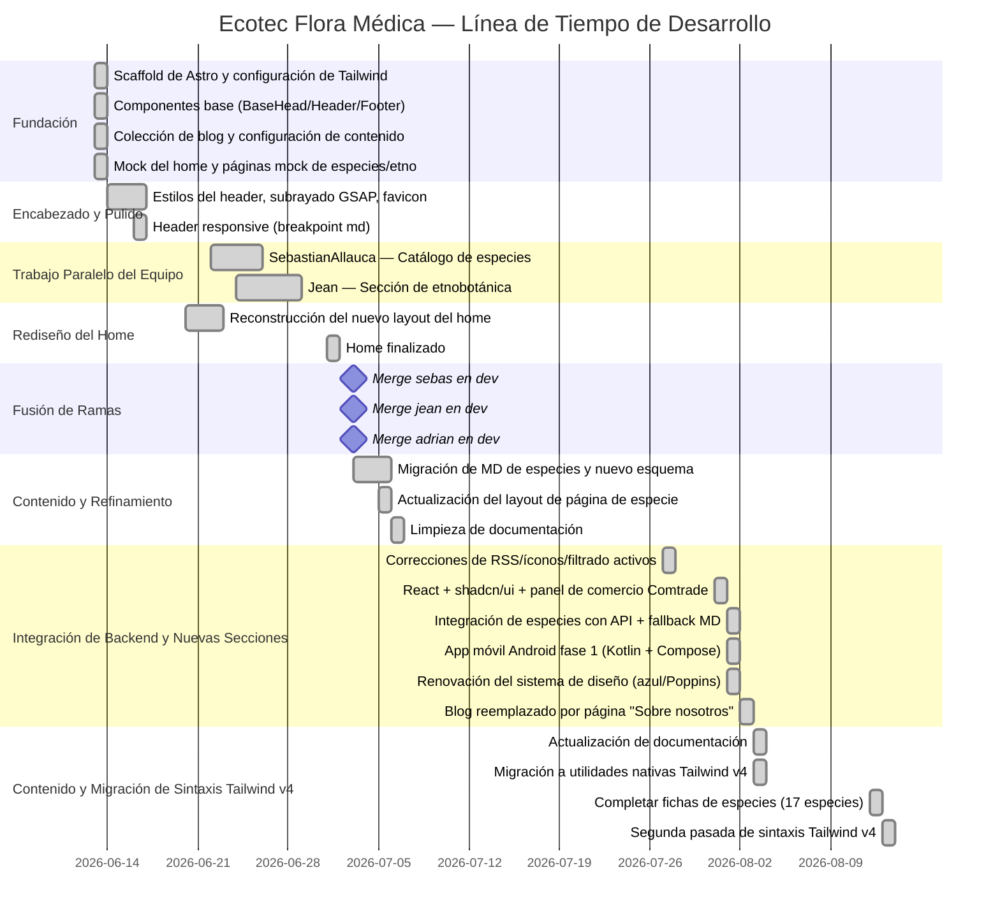

# Historial de Desarrollo — Ecotec Flora Médica

Narrativa cronológica del desarrollo del proyecto reconstruida a partir del historial de Git. Los mensajes de commit se citan textualmente. El contexto inferido está marcado como **[inferido]**.

---

## Resumen de la Línea de Tiempo

---

## Fase 1 — Inicialización del Proyecto (2026-06-13)

### Scaffold Inicial de Astro
**Commit:** `"Initial commit from Astro"` — `houston[bot]`

El proyecto se inicializó usando el starter oficial de la CLI de Astro. Esto creó la estructura base del proyecto incluyendo el `package.json` predeterminado, tsconfig y páginas de marcador de posición.

### Configuración de Tailwind
**Commits:** `[chore] actualización de dependencias. Tailwind para el proyecto`, `[chore] actualización de configuración de astro`, `[chore] actualización de permisos para hacer builds con pnpm`

Inmediatamente después del scaffold, Adrian Palma configuró Tailwind CSS v4 usando el enfoque del plugin `@tailwindcss/vite` (la nueva integración nativa de Vite con Tailwind, no la basada en PostCSS). El archivo `astro.config.mjs` se actualizó para agregar el plugin Vite de Tailwind y la integración de `@astrojs/sitemap`. **[inferido]** La decisión de usar Tailwind v4 desde el inicio sugiere que el equipo quería las últimas funcionalidades (tokens de diseño nativos de CSS mediante `@theme`, sin necesidad de archivo `tailwind.config.js`).

### Fundación de SEO
**Commits:** `[feat] título y descripción meta para SEO del home`, `[feat] componente que configura de metadata a través de props para cada página`

Se construyó tempranamente un componente `BaseHead.astro` reutilizable — antes de cualquier página real — demostrando una mentalidad de SEO desde el principio. Acepta las props `title`, `description` y una `image` opcional, y genera etiquetas OG/Twitter Card completas en cada página.

### Componentes de Infraestructura Base
**Commit:** `[feat] componentes generales para metadata, header y footer`

`Header.astro`, `Footer.astro`, `HeaderLink.astro` y `Layout.astro` se crearon en un único commit. Esto estableció el envoltorio de página universal que utilizan todas las rutas. **[inferido]** El enfoque todo-en-uno sugiere que se realizó como una sesión de configuración rápida.

### Configuración de Contenido y Blog
**Commits:** `[feat] configuración de contenido para posts y post example`, `[feat] configuración de página de blog y slug para blog post`

Se configuró la colección de contenido de Astro para `blog` con un esquema Zod, se agregó una entrada de ejemplo y se crearon las páginas de índice `/blog` y de detalle `/blog/[slug]`.

### Sitemap y Robots
**Commits:** `[chore] configuración de sitemap` (×2), `[feat] configuración de robots`

Se configuró la integración del sitemap (aparentemente necesitó dos intentos) y se creó un endpoint `robots.txt.ts` que referencia automáticamente la URL del sitemap.

### Páginas Mock
**Commits:** `[feat] mock de la página home`, `[feat] páginas mock para especies y etnobotánica`, `[feat] layout wrapper reutilizable`

Se creó contenido provisional para las páginas de inicio, especies y etnobotánica. El envoltorio reutilizable `Layout.astro` se extrajo en este punto.

---

## Fase 2 — Pulido del Encabezado y Sistema de Diseño (2026-06-13 al 2026-06-16)

### Primera Pasada de Estilos
**Commits:** `[style]`, `[style] cambios de estilo del botón suscribirme`, `[style] cambios en el estilo del texto del footer y botón suscribirse del header`

Múltiples commits de estilo rápidos refinaron el botón del encabezado, el texto del pie de página y la apariencia general. **[inferido]** Estos commits representan una sesión exploratoria de diseño más que incrementos planificados.

### Comportamiento del Encabezado
**Commit:** `[feat + style] cambios en el comportamiento del navbar y estilo general de la página`

El encabezado se convirtió de una barra estática a un elemento fijo con efecto de vidrio esmerilado usando `backdrop-blur` y `bg-white/60`. Los enlaces de navegación recibieron su lógica de detección de estado activo.

### Animación GSAP Añadida
**Commits:** `[chore] actualización de dependencias, gsap para animaciones`, `[feat] animación de underline para header links`

Se añadió GSAP como dependencia de producción y se implementó la animación de subrayado en los enlaces del encabezado: un subrayado animado con `scaleX` que se expande al pasar el cursor y se retrae hacia la derecha al salir, usando una timeline de GSAP con `tweenFromTo`.

### Favicon
**Commit:** `[chore] nuevo favicon agregado`

Se añadió un `favicon-02.ico` personalizado a `public/` y se conectó a `BaseHead.astro`, reemplazando el favicon SVG predeterminado de Astro.

### Encabezado Responsive
**Commit:** `[feat] responsive header para pantallas md`

La navegación recibió padding responsive (`md:px-6 lg:px-60`) para evitar que los elementos del nav colapsaran en pantallas medianas.

---

## Fase 3 — Rediseño de la Página de Inicio (2026-06-20 al 2026-07-01)

### Trabajo Inicial en el Layout del Home
**Commits:** `[feat] avance del nuevo layout para home`, `[fix] avance en la reconstrucción del diseño del home`, `[fix] espaciado de los elementos del header ajustados`

La página de inicio predeterminada de Astro se reemplazó con un layout personalizado de múltiples secciones. Esto implicó commits iterativos corrigiendo alineación y espaciado — particularmente entre el encabezado fijo y el contenido de la página. **[inferido]** Los dos commits `[fix]` sugieren que el padding superior `pt-24` para compensar el encabezado fijo se calibró durante este período.

### Home Finalizado
**Commit:** `[feat] página home`

Se confirmó la página de inicio completa con todas las secciones:
- Hero con layout dividido (titular + cuadrícula de imágenes)
- Barra de contador de estadísticas (27 especies, 10 familias, 4 dimensiones de estudio, 3 matrices analíticas) — fondo verde `#27692b`
- Sección del formulario de suscripción al boletín (fondo oscuro/negro)
- Sección "Marco de Estudio" con 4 tarjetas (fondo azul claro `#eaf5ff`)

---

## Fase 4 — Desarrollo Paralelo por Ramas (2026-06-22 al 2026-06-29)

El desarrollo se dividió en al menos tres ramas con nombre: `sebas` (SebastianAllauca), `jean` (Jean) y `adrian` (Adrian Palma). Un cuarto colaborador ("Astic" / Luis) realizó dos commits experimentales (`prueba xd`, `preuba 2 xd`) el 17-06-2026.

### Rama: sebas — Catálogo de Especies (SebastianAllauca)

| Fecha | Commit |
|---|---|
| 2026-06-22 | `[feat]: catálogo de especies optimizado con funciones de búsqueda y filtrado` |
| 2026-06-22 | Merge `sebas` → `dev` |
| 2026-06-26 | `feat(especies): migrar schema al contrato real del backend` |
| 2026-06-26 | `docs: agregar referencia de schema del backend` |
| 2026-06-26 | `[feat]: implementar catálogo de especies con páginas de detalle y mejoras de UI` |
| 2026-06-26 | `[docs]: Creación de bitácora semanal rama sebas` |
| 2026-06-26 | `[docs]: Edición de bitácora semanal rama sebas` |

SebastianAllauca construyó la funcionalidad central de especies: la página de catálogo `/especies` con búsqueda, filtro taxonómico y paginación, además de las páginas de detalle `/especies/[slug]`. Un commit crítico fue "migrar schema al contrato real del backend" — reemplazando un esquema provisional simple con el contrato rico de especies (taxonomía, etnobotánica, historia, comercio, compuestos químicos, multimedia) destinado a reflejar una API real de backend. Los commits `[docs]` indican que este desarrollador también mantenía un diario de desarrollo semanal **[inferido: requisito de un proyecto universitario]**.

### Rama: jean — Sección de Etnobotánica (Jean)

| Fecha | Commit |
|---|---|
| 2026-06-24 | `Actualizacion de la página etnobotánica` |
| 2026-06-29 | `feat: agrega sección etnobotánica` |
| 2026-06-29 | `merge con origin/jean` |
| 2026-06-29 | `feat: agrega paginación en etnobotánica` |

Jean construyó toda la sección `/etnobotanica`: el hero, los botones de filtro (7 categorías con íconos de Tabler), la cuadrícula de tarjetas y la paginación del lado del cliente — todo en aproximadamente una semana de trabajo.

---

## Fase 5 — Fusión de Ramas e Integración (2026-07-03)

**Commits:** `Merge branch 'adrian' into dev`, `Merge branch 'sebas' into dev`, `Merge branch 'jean' into dev`

Las tres ramas de funcionalidades se fusionaron en `dev` el mismo día. A esto le siguieron inmediatamente varios commits de integración y corrección:

- `[feat] minor changes`
- `[feat] actualización y especies agregadas`
- `[feat] etnobotánica agregada`
- `[feat] actualización de la página etnobotánica`
- `[feat] cambios de estilo en título de sección suscribirse`

---

## Fase 6 — Migración de Contenido y Refinamiento del Esquema (2026-07-03 al 2026-07-06)

### Nueva Estructura de Archivos MD
**Commit:** `[feat] nueva estructura para archivos md` (2026-07-04)

Los archivos de contenido Markdown de especies se refactorizaron para usar el esquema rico de frontmatter YAML (taxonomia, etnobotanica, perfilEtnobotanico, historiaEvolucion, comercio, compuestosQuimicos, multimediaPrincipal, estado). **[inferido]** Esta fue la carga masiva de contenido: 39 archivos de especies con perfiles detallados.

### Correcciones Menores
**Commits:** `cambios menores`, `[chore] actualización de archivos md`, `[chore] eliminación de parte del código` (2026-07-04)

Limpieza y correcciones de contenido después de la migración masiva.

### Actualización del Layout de la Página de Detalle de Especie
**Commit:** `[feat] actualización del layout de la página para cada planta` (2026-07-05)

La página de detalle `/especies/[slug]` recibió su última pasada de layout — agregando la sección hero completa, las migas de pan taxonómicas, secciones académicas/químicas/comerciales y la barra lateral del perfil etnobotánico.

### Limpieza de Documentación
**Commit:** `[chore] eliminación de archivos innecesarios para la nueva documentación` (2026-07-06)

Se eliminaron archivos obsoletos o redundantes para limpiar el repositorio en preparación para la generación de documentación.

---

## Fase 7 — Integración de Backend, Nuevas Secciones y App Móvil (2026-07-27 al 2026-08-02)

Tras casi tres semanas sin cambios sustanciales (última entrada de la Fase 6 el 06-07), el proyecto retoma actividad intensa el 27 de julio con una serie de commits que cierran brechas entre el frontend y el backend real, agregan dos secciones nuevas y arrancan un cliente móvil nativo.

### Correcciones Pendientes y Primer Intento de RSS
**Commit:** `fix: iconos de etnobotanica, feed RSS, formulario de suscripcion y filtrado de especies activas` (`76cb87d`, 2026-07-27)

Se resuelven varios cabos sueltos acumulados: falta la fuente de íconos Tabler (los badges de etnobotánica se veían rotos), `BaseHead.astro` anunciaba un feed RSS que no existía (se agrega `@astrojs/rss` y `src/pages/rss.xml.js` — eliminado una semana después junto con el blog), el formulario de suscripción todavía apuntaba a una URL localhost fija en vez del servicio real, y el filtro `estado === 'ACTIVO'` solo se aplicaba en el atlas de etnobotánica y no en el catálogo de especies ni en el home.

### Configuración de React y shadcn/ui
**Commit:** `chore: configurar React, shadcn/ui y Tailwind v4 en el proyecto` (`3129b4b`, 2026-07-31)

Se agrega `@astrojs/react`, React 19 y la CLI de shadcn/ui (estilo `base-nova`), sentando la base para el primer componente interactivo con estado del sitio. **[inferido]** Esta fue una decisión deliberada de introducir React solo donde el patrón "Astro + `<script>` vanilla" no alcanzaba (un selector con estado y un gráfico), sin migrar el resto del sitio.

### Panel de Comercio Internacional (Comtrade)
**Commit:** `feat: agregar sección de importación y exportación con datos de UN Comtrade` (`d0a387e`, 2026-07-31)

Nueva página `/importacion-exportacion` que cruza las fichas de especie con cifras reales de UN Comtrade (pre-procesadas en `src/data/trade-data.json`): KPIs, un explorador interactivo con gráfico de barras (primera isla React del proyecto, `TradeExplorer.tsx`) y una tabla completa. Documentado en profundidad en `docs/api_usage.md`, agregado el mismo día (`7559d39`) con un manual completo de la API del backend, incluyendo hallazgos de pruebas reales contra el backend (bugs de validación entre Mongoose y los validadores de esquema de MongoDB).

### Modal de Etnobotánica y Correcciones Menores
**Commits:** `feat: nueva pantalla modal para etnobotanica...` (`cef74d5`), `fix: forzar NODE_ENV=development...` (`c6281ee`), `fix: corregir colores del panel de etnobotánica...` (`874c6d4`) — todos 2026-07-31

Se agrega un modal de detalle rápido a las tarjetas del atlas de etnobotánica (`Etnobotanicamodal.astro`) y se corrigen un bug de `NODE_ENV` que rompía `jsxDEV` en desarrollo y colores inconsistentes en la barra lateral etnobotánica del detalle de especie.

### Integración Real de Especies con la API
**Commit:** `feat: integrar datos de especies desde la API con respaldo en Markdown` (`59d646b`, 2026-08-01)

El cambio más significativo de arquitectura desde la eliminación de la colección `etnobotanica`: se agrega `src/lib/species-source.ts`, que intenta `GET /api/plantas` y fusiona el resultado *campo a campo* con el contenido `.md` local, cayendo a este último si el backend no responde. Todas las páginas que antes llamaban a `getCollection('species')` directamente pasan a usar esta capa. Es la primera vez que el sitio consume datos reales del backend para algo más que el formulario de suscripción.

### App Móvil Android — Fase 1
**Commits:** `[feat] app movil Android (Kotlin + Compose) - fase 1 datos locales` (`f727945`), `[feat] mejoras app movil...` (`580adf5`) — ambos 2026-08-01, por Raúl Stephano Coello Albán (`stexc7`)

Arranca un cliente nativo Android independiente en `mobile/` (proyecto Gradle propio), con arquitectura por capas (patrón Repository) y un dataset local extraído del contenido del sitio (`assets/content.json`), sin depender del backend todavía. El segundo commit agrega la pantalla de detalle de etnobotánica, mejora la silueta corporal interactiva y pule tipografía/animaciones. Ver `mobile/README.md` para el detalle completo.

### Renovación del Sistema de Diseño
**Commit:** `feat: renovar sistema de diseño y agregar paginación a la tabla de comercio` (`07782b6`, 2026-08-01)

Segunda migración de paleta del proyecto (la primera fue verde → azul plano el 13-07): de azul plano a escalas completas `primary`/`secondary`/`neutral` de 10 pasos, y de EB Garamond + Hanken Grotesk a Poppins como tipografía única. Se agrega también paginación del lado del cliente a la tabla del panel de comercio.

### Blog Reemplazado por "Sobre Nosotros"
**Commit:** `feat: reemplazar sección de blog por página "Sobre nosotros"` (`a979739`, 2026-08-02)

Se retira por completo la funcionalidad de blog (colección de contenido, páginas, feed RSS) — que había existido desde el scaffold inicial con una única entrada de ejemplo y nunca llegó a usarse editorialmente — y se reemplaza por una página institucional con misión, equipo y valores, más alineada con el propósito del proyecto de vinculación universitaria.

---

## Fase 8 — Contenido y Migración de Sintaxis Tailwind v4 (2026-08-03 al 2026-08-13)

Tras la renovación del sistema de diseño (Fase 7), una segunda pasada corta se enfocó en completar contenido pendiente y limpiar deuda de sintaxis acumulada de la migración a Tailwind v4.

### Completar Información Faltante en Fichas de Especies
**Commit:** `content: completar información faltante en fichas de especies` (`eff9c9d`, 2026-08-12)

Se investigó y redactó taxonomía, historia/evolución, compuestos químicos y comercio (exportación/importación) para 17 especies que tenían campos vacíos desde la migración masiva de contenido de la Fase 6: hortensia, lazo-de-amor, madre-de-miles, dulcamara, tomate, naranjo-amargo y perejil (campos completos faltantes), más 10 especies a las que solo les faltaba el texto de evolución (guanábana, guayaba, limón, mandarina, matico, naranja dulce, neem, papaya, tomate de árbol, zapallo). No cambia el esquema de contenido ni el conteo total de especies (permanece en 41).

### Migración a Utilidades Nativas de Tailwind v4
**Commits:** `chore: actualización de la sintaxis de tailwind para la pagina sobre nosotros` (`7e1d267`, 2026-08-03), `fix: tailwind classes` (`f1f756f`, 2026-08-13)

Dos pasadas que reemplazan valores arbitrarios (`[1480px]`, `[26rem]`, `[520px]`, `[calc(...)]` de transformación 3D, `bg-gradient-to-*`) por las utilidades de escala nativas que Tailwind v4 agregó para estos casos (`max-w-370`, `min-h-104`, `h-130`, `aspect-4/3`, `perspective-distant`, `transform-3d`, `backface-hidden`, `bg-linear-to-*`). Afecta `index.astro`, `especies.astro`, `especies/[slug].astro`, `etnobotanica.astro`, `importacion-exportacion.astro` y `sobre-nosotros.astro`. Cambio puramente sintáctico — sin impacto visual ni de comportamiento.

---

## Colaboradores

| Nombre | Rol |
|---|---|
| Adrian Leniel Palma Santana | Líder de Diseño; arquitectura, página de inicio, sistema de diseño, panel de comercio, integración de especies con la API, coordinación |
| Luis David Aurea Ramírez | Líder de Base de Datos |
| Luis Anibal Eraso Viteri | Líder de Desarrollo; integración de suscriptores con el backend |
| Raúl Stephano Coello Albán (`stexc7`) | Líder de Infraestructura; app móvil Android nativa |
| Nestor Camilo Ruiz Conforme | Docente de Vinculación |
| SebastianAllauca | Catálogo de especies, páginas de detalle de especies, definición del esquema del backend (fase temprana) |
| Jean | Sección de etnobotánica — página del atlas, filtros, paginación (fase temprana; funcionalidad luego refactorizada para derivar de `species`) |
| Astic / Luis | Contribuciones experimentales (2 commits el 17-06-2026) |

> Los roles y nombres completos provienen de la página `/sobre-nosotros` (agregada el 2026-08-02); el rol de Líder de Documentación figura vacante ahí.

---

## Decisiones Arquitectónicas Clave (Inferidas del Historial)

1. **Astro puro con islas de React puntuales** — Toda la interactividad del catálogo/atlas sigue siendo TypeScript vanilla en `<script>`. React se introdujo el 31-07-2026 (`3129b4b`) únicamente para el panel de comercio, que necesitaba estado de UI (selector) y un gráfico (Recharts) — un caso donde el patrón vanilla ya no alcanzaba. El resto del sitio deliberadamente no migró a React.
2. **Colecciones de contenido como respaldo, no como fuente única** — El equipo usó las colecciones de contenido con tipado de Astro como capa de datos local desde el inicio, con la intención explícita de intercambiarlas por una API real más adelante. Esa migración arrancó el 01-08-2026 (`59d646b`) con una estrategia de *merge por campo* (API primero, `.md` como fallback) en vez de un corte abrupto, lo que permite desplegar la integración sin que una caída del backend rompa el sitio.
3. **Tailwind v4 (nativo de CSS)** — Elegido al inicio del proyecto; refleja el conocimiento de la dirección del ecosistema. shadcn/ui se sumó después sobre la misma base de Tailwind v4 sin fricción.
4. **Derivar en vez de duplicar contenido** — Tanto el atlas de etnobotánica (desde 15-07) como el panel de comercio (desde 31-07) se construyen derivando datos de la colección/fuente `species` en vez de mantener su propio contenido, evitando desincronización entre secciones.
5. **Estrategia de ramas paralelas** — Las funcionalidades se desarrollaron de forma aislada (`sebas`, `jean`, `adrian`) y se fusionaron, coherente con el flujo de trabajo de un equipo universitario donde los miembros trabajan de forma independiente. El mismo patrón se repite en la fase reciente con el trabajo de app móvil de Raúl/`stexc7` desarrollado en paralelo a la integración de API y el rediseño de Adrian.
