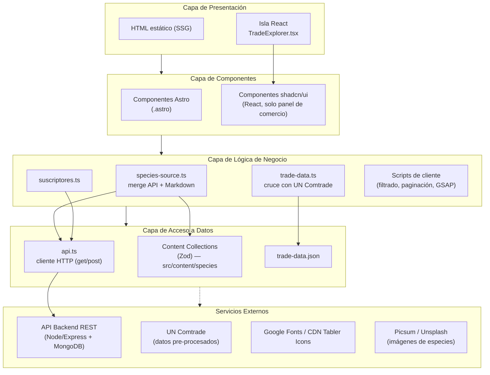
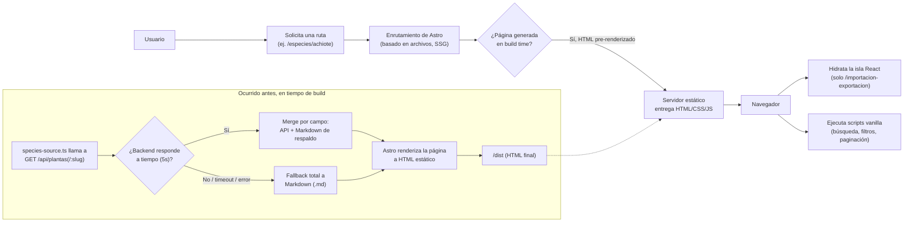
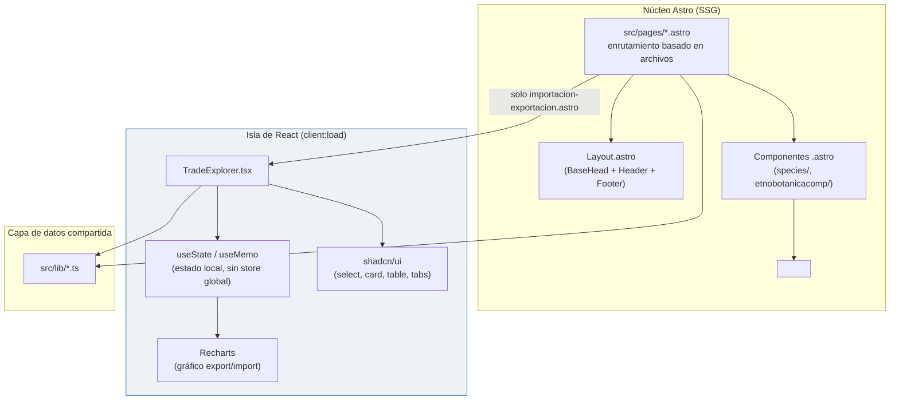
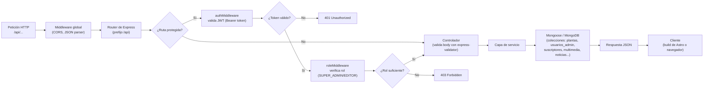
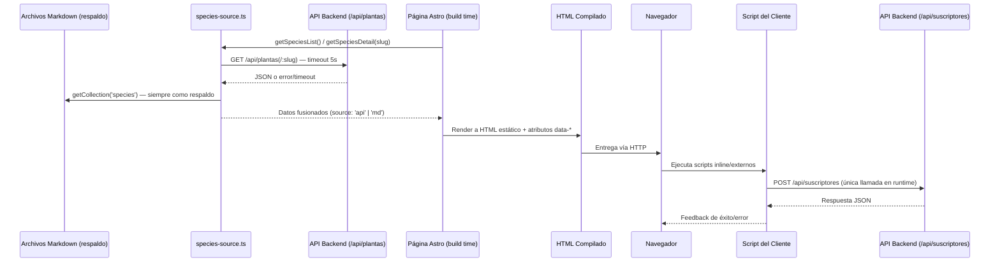
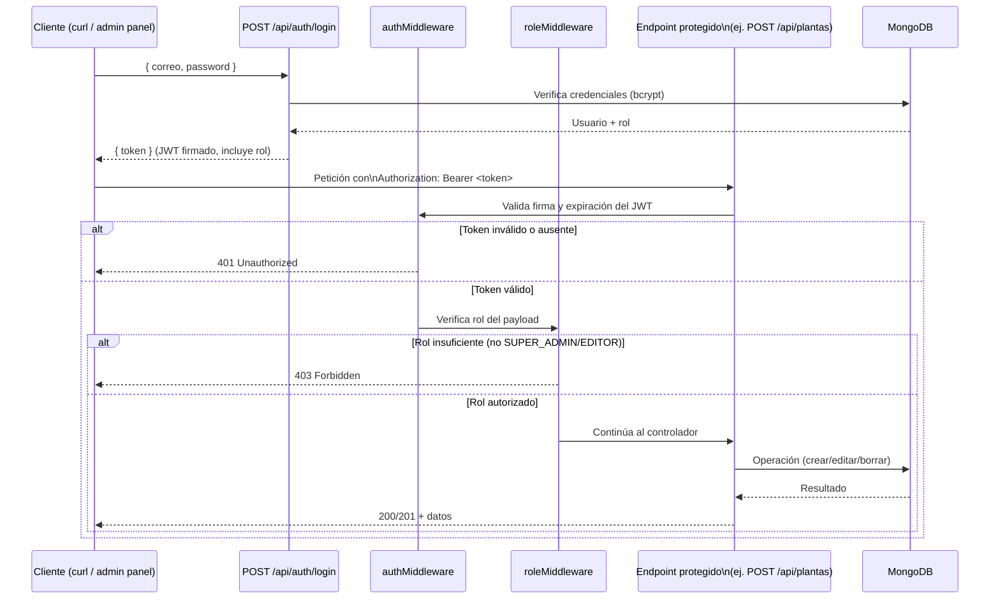

# Diagramas para el Reporte — Ecotec Flora Médica

Diagramas en código Mermaid listos para insertar en el documento (sección 6 "Arquitectura del Sistema" y sección 13.2 "Seguridad"). Generados a partir de `docs/ARCHITECTURE.md`, `docs/FRONTEND_INTEGRACION_BACKEND.md`, `docs/DEPLOYMENT.md` y `docs/api_usage.md`.

---

## 1. Arquitectura general por capas



---

## 2. Diagrama de flujo del sistema (petición del usuario)



---

## 3. Arquitectura Frontend (Astro + islas de React)



---

## 4. Arquitectura Backend — ciclo de vida de una petición

> Inferido de `docs/api_usage.md` (Node/Express + MongoDB/Mongoose, JWT). El backend es un repositorio independiente; este diagrama documenta el contrato observado, no el código fuente.



---

## 5. Secuencia de integración Frontend–Backend



---

## 6. Flujo de autenticación y autorización JWT



---

## 7. Pipeline de build (referencia — ya documentado en `DEPLOYMENT.md`)

```mermaid
flowchart LR
    A[pnpm build] --> B[Carga astro.config.mjs]
    B --> C[Escanea src/content/species]
    C --> D[Valida frontmatter con Zod]
    D --> E{Validación OK?}
    E -->|No| F[Build falla]
    E -->|Sí| G[species-source.ts: API + fallback MD]
    G --> H[Genera páginas estáticas]
    H --> I[Optimiza imágenes]
    I --> J[Empaqueta Tailwind + shadcn/ui]
    J --> K[Empaqueta JS: GSAP + filtros + isla React]
    K --> L[Genera sitemap]
    L --> M[/dist]
```

---

### Notas de uso

- Los diagramas 1–4 y 6 son **nuevos** (no existían antes en `docs/`).
- Los diagramas 5 y 7 son versiones limpias/reordenadas de los que ya existen en `ARCHITECTURE.md` y `DEPLOYMENT.md` respectivamente — reutilízalos si prefieres mantener una sola fuente de verdad.
- El diagrama 4 (backend) es **inferido** a partir del comportamiento documentado en `api_usage.md` (no hay acceso al código fuente del backend en este repositorio); dejar la nota de "inferido" si se incluye en el reporte formal.
- Para pegarlos en Word/PDF: renderízalos con [mermaid.live](https://mermaid.live) o con un plugin de Mermaid en el editor que uses, y exporta como PNG/SVG.
